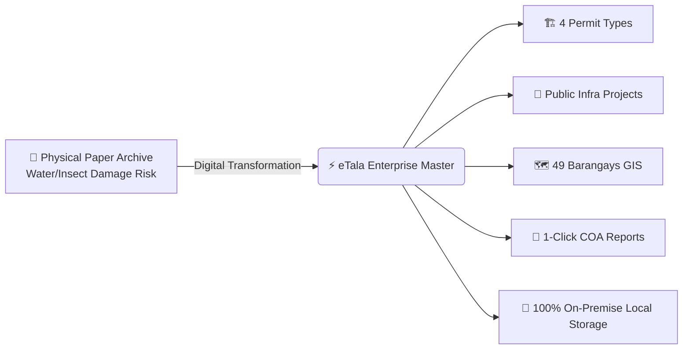
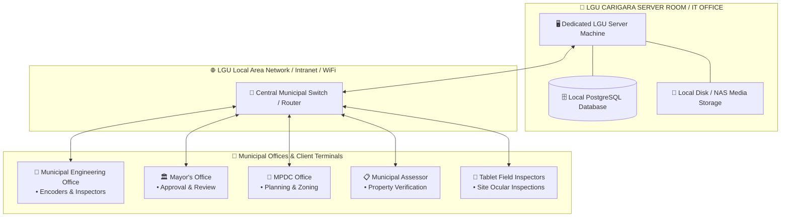
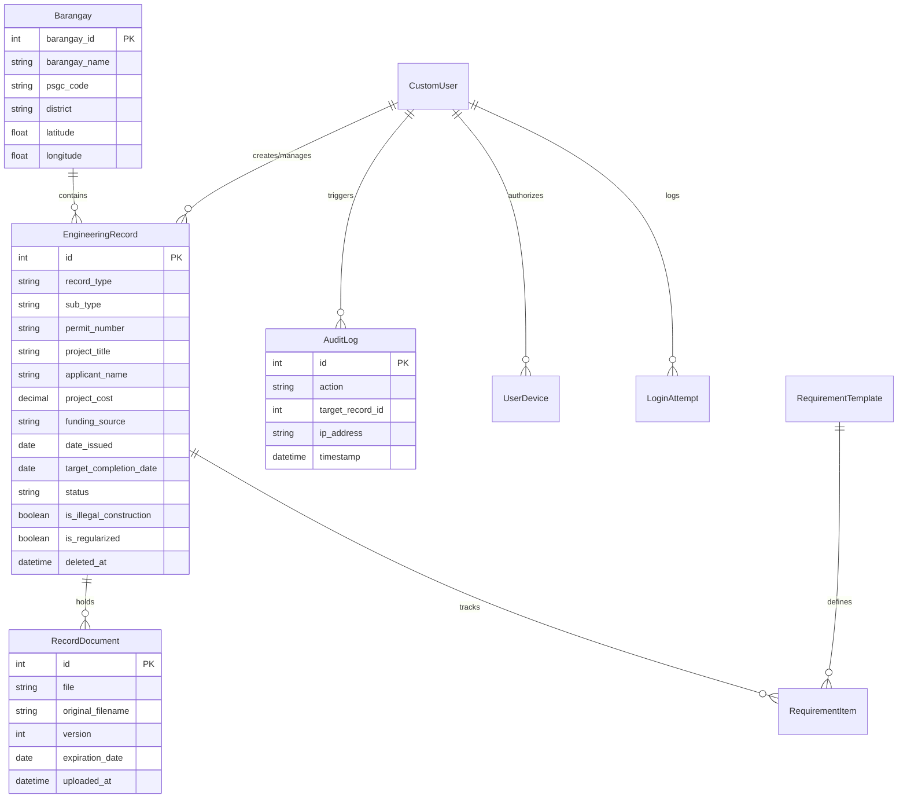
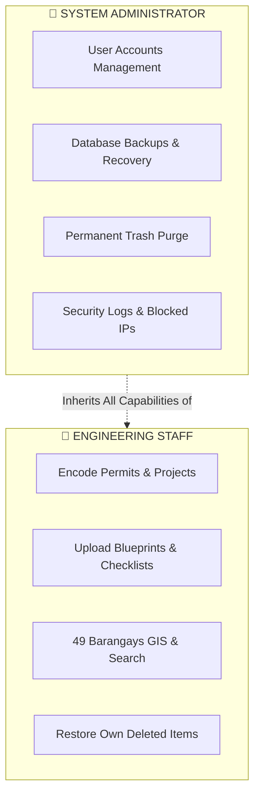
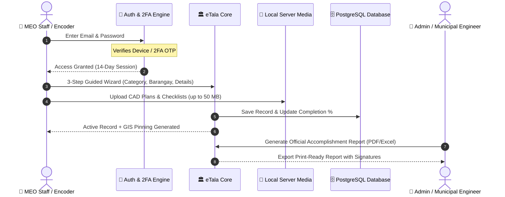
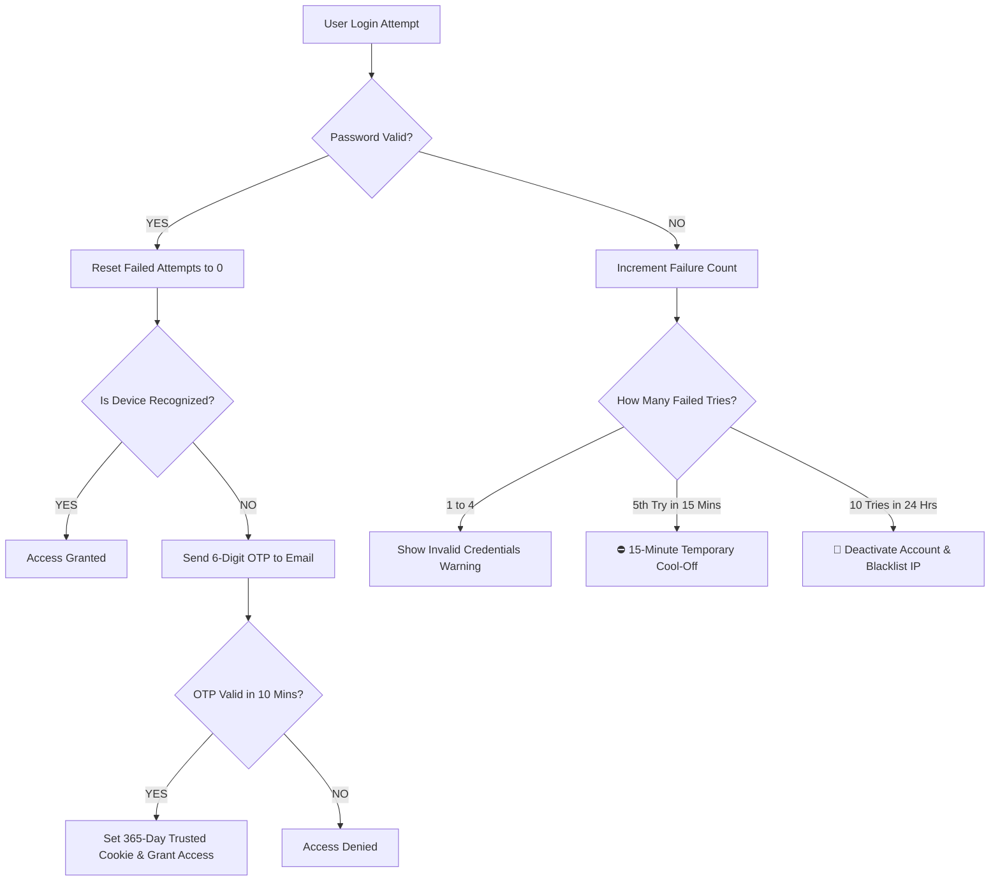
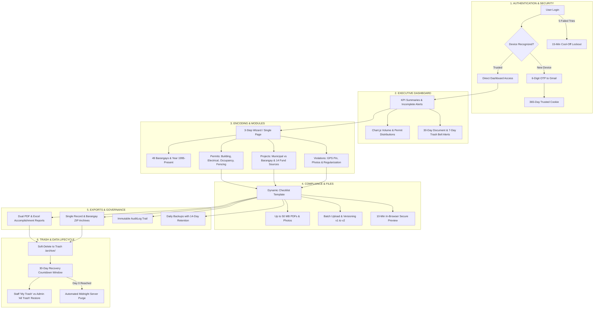

# 🌟 eTala: Engineering Records Archiving & Retrieval Management System
### 🏛️ Municipal Engineering Office — Local Government Unit (LGU) of Carigara, Leyte
**📘 Master System Documentation, Academic Manuscript Reference & Operational Manual (Version 2.0)**

---

## 📑 Table of Contents
* [1. 🎯 Project Context, Problem Statement & Plain-Language Purpose](#1--project-context-problem-statement--plain-language-purpose)
* [2. 🏛️ Academic / Thesis Manuscript Chapter Mapping](#2-️-academic--thesis-manuscript-chapter-mapping)
* [3. 💻 System Architecture, Tech Stack & On-Premise Infrastructure](#3--system-architecture-tech-stack--on-premise-infrastructure)
* [4. 🗄️ Database Schema & Entity-Relationship Architecture (ERD)](#4-️-database-schema--entity-relationship-architecture-erd)
* [5. 👥 User Roles & Permissions (Access Control Matrix)](#5--user-roles--permissions-access-control-matrix)
* [6. 🔄 End-to-End System Workflow & Lifecycle](#6--end-to-end-system-workflow--lifecycle)
* [7. 👤 User Accounts, Staff Provisioning & Safe Deactivation](#7--user-accounts-staff-provisioning--safe-deactivation)
* [8. 🔐 Security, 2FA Device Approval, Lockout & Encryption Rules](#8--security-2fa-device-approval-lockout--encryption-rules)
* [9. 📊 Executive Dashboard, Analytics & Visualizations](#9--executive-dashboard-analytics--visualizations)
* [10. 📝 Records Encoding, 3-Step Wizard & Bulk Ingestion](#10--records-encoding-3-step-wizard--bulk-ingestion)
* [11. 🏗️ Official Engineering Permits Management (PD 1096)](#11-️-official-engineering-permits-management-pd-1096)
* [12. 🌉 Municipal & Barangay Infrastructure Projects](#12--municipal--barangay-infrastructure-projects)
* [13. 🚨 Illegal Construction Monitoring & Regularization Process](#13--illegal-construction-monitoring--regularization-process)
* [14. 📁 Document Archiving, CAD Blueprints & Versioning (v1 $\rightarrow$ v2)](#14--document-archiving-cad-blueprints--versioning-v1-rightarrow-v2)
* [15. 🗺️ 49-Barangay GIS Interactive Map & Centroid Coordinates](#15-️-49-barangay-gis-interactive-map--centroid-coordinates)
* [16. 🔍 Universal Multi-Token Live Search Engine](#16--universal-multi-token-live-search-engine)
* [17. 🔔 Expiration Alerts, Notifications & Cross-Device Sync](#17--expiration-alerts-notifications--cross-device-sync)
* [18. 🗑️ 30-Day Trash Recovery Window & Automated Purge Routine](#18-️-30-day-trash-recovery-window--automated-purge-routine)
* [19. 📄 Official Accomplishment Reports & Legal Signatures (PDF / Excel)](#19--official-accomplishment-reports--legal-signatures-pdf--excel)
* [20. 📜 Immutable Audit Trail & Accountability Logs](#20--immutable-audit-trail--accountability-logs)
* [21. 📦 Automated Data Export & ZIP Archival Structures](#21--automated-data-export--zip-archival-structures)
* [22. ⚙️ System Settings, Disaster Recovery & Database Backups](#22-️-system-settings-disaster-recovery--database-backups)
* [23. ⚖️ Legal & Regulatory Compliance (RA 10173, PD 1096, COA)](#23-️-legal--regulatory-compliance-ra-10173-pd-1096-coa)
* [24. 🧪 System Testing, Verification & Quality Assurance](#24--system-testing-verification--quality-assurance)
* [25. 🗺️ Complete End-to-End System Master Flowchart](#25-️-complete-end-to-end-system-master-flowchart)

---

## 1. 🎯 Project Context, Problem Statement & Plain-Language Purpose

### 💡 What is eTala?
**eTala** (combining the digital prefix *"e"* for electronic governance and the Filipino word *"Tala"* meaning record, star, or guiding light) is the specialized web-based **Engineering Records Archiving and Retrieval Management System (ERARMS)** engineered specifically for the **Municipal Engineering Office (MEO) of Carigara, Leyte, Philippines**.



### 🔴 Problem Statement (The Legacy Setup)
Prior to eTala, the Carigara Municipal Engineering Office managed thousands of physical building permits, CAD blueprints, and infrastructure folders manually:
1. **Slow Retrieval Times**: Finding historical permits or blueprint plans from past years took hours to days of manually searching physical filing cabinets.
2. **Physical Degradation & Disaster Vulnerability**: Physical paper documents in coastal Leyte are vulnerable to typhoons, floodings, humidity, termites, and accidental misplacement.
3. **Tracking Compliance Gaps**: LGU inspectors had no automated alert system to track expiring Fire Safety (FSIC) certificates, contractor insurance bonds, or pending checklist items.
4. **Disjointed Reporting for Audits**: Preparing Annual Accomplishment Reports for the **Commission on Audit (COA)** or the **Sangguniang Bayan (SB)** required days of manual spreadsheet compilation.

### 🟢 The eTala Solution (Core Objectives)
1. 🗂️ **Zero Misplaced Folders**: 100% centralized digital indexing for all 4 permit types (*Building, Electrical, Occupancy, Fencing*) and public civil works (*Municipal and Barangay*).
2. 🗺️ **Full 49-Barangay Coverage**: Dedicated interactive geospatial mapping and digital workspace for all 49 barangays of Carigara.
3. 📋 **Automated Checklists**: Dynamic requirement slots (*Tax Declarations, Structural Plans, Fire Safety Certificates*) auto-generated per record.
4. 🔍 **Crystal-Clear In-Browser CAD Blueprint Viewer**: Pan, zoom, and inspect high-resolution CAD drawings directly in the web browser without downloading.
5. 📊 **1-Click Print-Ready Reports**: Generates formal PDF and Excel accomplishment reports with official municipal letterheads and tripartite signature blocks.
6. 🔒 **100% Data Sovereignty & Zero Recurring Cost**: Operates entirely on-premise on the LGU's local dedicated server with zero dependency on costly cloud subscriptions.

---

## 2. 🏛️ Academic / Thesis Manuscript Chapter Mapping

For students, researchers, and developers drafting their Capstone / Thesis Manuscript, eTala directly maps to the standard 5-Chapter IMRAD format:

```
┌────────────────────────────────────────────────────────────────────────┐
│               THESIS / CAPSTONE MANUSCRIPT MAPPING                      │
├─────────────────┬──────────────────────────────────────────────────────┤
│ 📖 Chapter 1    │ • Introduction, Project Context & Objectives         │
│ (Introduction)  │ • Problem Statement & Scope/Delimitations            │
│                 │ • Significance to LGU Carigara & DICT Standards      │
├─────────────────┼──────────────────────────────────────────────────────┤
│ 📚 Chapter 2    │ • Review of Related Literature & Studies (RRL/RRS)   │
│ (RRL & Systems) │ • National Building Code (PD 1096) & PSGC Standards  │
│                 │ • Data Privacy Act (RA 10173) & Electronic Gov Laws  │
├─────────────────┼──────────────────────────────────────────────────────┤
│ 🛠️ Chapter 3    │ • Agile Software Development Lifecycle (SDLC)        │
│ (Methodology)   │ • System Architecture & On-Premise Network Topology  │
│                 │ • Database ERD, Data Dictionary & Security Model     │
├─────────────────┼──────────────────────────────────────────────────────┤
│ 💻 Chapter 4    │ • Results, Discussion & Feature Implementation       │
│ (Results & UI)  │ • Module Walkthroughs, GIS Engine & Report Exports   │
│                 │ • User Acceptance Testing (UAT) & Performance Stats │
├─────────────────┼──────────────────────────────────────────────────────┤
│ 🎯 Chapter 5    │ • Summary of Findings, Conclusions & Recommendations │
│ (Conclusion)    │ • Future Expansion (Barangay Portal Integration)     │
└─────────────────┴──────────────────────────────────────────────────────┘
```

---

## 3. 💻 System Architecture, Tech Stack & On-Premise Infrastructure

### 3.1 Technology Stack Matrix

| Layer | Technology | Version | Key Purpose |
| :--- | :--- | :--- | :--- |
| **Backend Framework** | **Python / Django** | 5.1+ | Robust MTV architecture, ORM, CSRF/Auth security |
| **Database Engine** | **PostgreSQL / SQLite** | 16+ / 3+ | High-concurrency relational data & zero-latency queries |
| **Frontend Core** | **HTML5, Vanilla CSS3, JavaScript (ES6+)** | Modern | Zero dependency bloat, maximum rendering speed |
| **Mapping Engine** | **Leaflet.js + OpenStreetMap** | 1.9+ | Fast client-side GIS rendering for all 49 barangays |
| **Visualizations** | **Chart.js** | 4.4+ | Interactive annual bar charts & permit distribution doughnuts |
| **Document Engine** | **WeasyPrint / ReportLab & openpyxl** | Latest | Vector PDF rendering with letterheads & multi-sheet Excel |
| **Email Relay** | **Brevo SMTP / Gmail Workspace** | TLS 587 | 2FA verification codes, password resets & error alerts |

### 3.2 Municipal On-Premise Network Topology

eTala is architected for **100% On-Premise / Local Intranet Hosting** inside the Municipal Hall of Carigara, Leyte:



### 3.3 Zero-Cloud Advantage
* **Zero Recurring Cost**: No monthly cloud hosting fees (Render, AWS, Supabase).
* **High-Speed Intranet Performance**: Loading large 50 MB CAD blueprints over local gigabit LAN occurs instantly without internet throttling.
* **100% Data Sovereignty**: All engineering blueprints and applicant personal details never leave the physical custody of LGU Carigara, ensuring full compliance with the **Data Privacy Act of 2012 (RA 10173)**.

---

## 4. 🗄️ Database Schema & Entity-Relationship Architecture (ERD)



---

## 5. 👥 User Roles & Permissions (Access Control Matrix)

eTala enforces a strict **2-Tier Role-Based Access Control (RBAC)** architecture:



### 📊 Master Permission Matrix

| 🛠️ System Action / Feature | 👷 Engineering Staff | 👑 System Administrator |
| :--- | :---: | :---: |
| **Encode New Permits, Projects & Violations** | 🟢 **Allowed** | 🟢 **Allowed** |
| **Edit & Update Active Records** | 🟢 **Allowed** | 🟢 **Allowed** |
| **Upload PDF Blueprints & Inspection Photos** | 🟢 **Allowed** | 🟢 **Allowed** |
| **In-Browser Document Preview (Pan/Zoom)** | 🟢 **Allowed** | 🟢 **Allowed** |
| **Search Records & Use 49 Barangays GIS Map** | 🟢 **Allowed** | 🟢 **Allowed** |
| **Export Accomplishment Reports (PDF & Excel)** | 🟢 **Allowed** | 🟢 **Allowed** |
| **Export Single Record / Barangay ZIP Packages** | 🟢 **Allowed** | 🟢 **Allowed** |
| **Move Records to Trash (Soft-Delete)** | 🟢 **Allowed** | 🟢 **Allowed** |
| **Restore Own Deleted Records ("My Trash")** | 🟢 **Allowed** | 🟢 **Allowed** |
| **Restore Other Staff's Records ("All Trash")** | 🔴 *Denied* | 🟢 **Allowed** |
| **Permanent Record Deletion (Early Purge)** | 🔴 *Denied* | 🟢 **Allowed** |
| **Export Municipal Master ZIP (All 49 Barangays)**| 🔴 *Denied* | 🟢 **Allowed** |
| **Create, Edit & Deactivate User Accounts** | 🔴 *Denied* | 🟢 **Allowed** |
| **Database Backups & 1-Click Restoration** | 🔴 *Denied* | 🟢 **Allowed** |
| **Configure LGU Seal & Signatory Settings** | 🔴 *Denied* | 🟢 **Allowed** |
| **Security Audit Logs & Blocked IP Management** | 🔴 *Denied* | 🟢 **Allowed** |

---

## 6. 🔄 End-to-End System Workflow & Lifecycle



---

## 7. 👤 User Accounts, Staff Provisioning & Safe Deactivation

* **Module**: `/users/` (System Administrators only).
* **Safe Deactivation Rule (`on_delete=models.PROTECT`)**:
  When an employee resigns or transfers, clicking **Deactivate** immediately revokes their login credentials. All historical records, blueprints, and audit trail entries created by that employee remain **100% intact and permanently preserved**.
* **Self-Service Email Change Security**:
  Updating a work email address requires completing a **6-digit verification code (OTP)** dispatched to the **CURRENT** registered email with a **10-minute validity** and a **60-second spam cooldown**.

---

## 8. 🔐 Security, 2FA Device Approval, Lockout & Encryption Rules



### 8.1 Security Constants & Numbers Cheat Sheet

| Parameter | Value | Description |
| :--- | :---: | :--- |
| **Tier 1 Failed Login Lockout** | **5 Attempts** | Triggers temporary **15-minute cool-off**. |
| **Tier 2 Failed Login Lockout** | **10 Attempts (24h)** | Deactivates account & blacklists client IP. |
| **2FA Verification Code (OTP)** | **6 Digits** | **10-minute validity**, max **5 attempts**. |
| **Trusted Device Duration** | **365 Days** | Bypasses OTP on recognized workstations for 1 year. |
| **Active Session Lifetime** | **14 Days** | Sliding session renewal across workdays. |
| **Document Secure Preview Link** | **10 Minutes** | Signed HMAC tokens prevent unauthorized URL sharing. |

---

## 9. 📊 Executive Dashboard, Analytics & Visualizations

* **Module**: `/dashboard/`
* **6 High-Visibility KPI Cards**: Real-time counts of Total Records, Municipal Projects, Barangay Projects, Issued Permits, Incomplete Checklists, and Trash Items.
* **Interactive Chart.js Visualizations**:
  * **Annual Volume Bar Chart**: Tracks infrastructure growth and permit issuance volume across years (1995–Present).
  * **Permit Distribution Doughnut**: Breaks down sub-types (Building, Electrical, Occupancy, Fencing).
* **Universal Search Bar (250px)**: Debounced live searching across all records directly from the top navigation.
* **Zero-Flicker Theme Switcher**: Toggle between Dark Navy and Clean White modes stored in `localStorage`.

---

## 10. 📝 Records Encoding, 3-Step Wizard & Bulk Ingestion

* **Method 1: 3-Step Guided Wizard (`/records/new/`)**:
  * **Step 1: Scope & Categorization**: Select category, sub-type, 1 of 49 barangays, and year.
  * **Step 2: Technical & Financial Details**: Permit number, applicant/contractor name, cost (₱), dates, and remarks.
  * **Step 3: Checklist Upload**: Dynamically generated slots for attaching required PDFs.
* **Method 2: Single-Screen Form (`/records/create/`)**: Rapid encoding when all data and attachments are pre-gathered.
* **Method 3: Bulk Data Ingestion (`/records/bulk-encoding/`)**: Multi-row rapid data entry for digitizing historical paper backlogs.

---

## 11. 🏗️ Official Engineering Permits Management (PD 1096)

* **Module**: `/permits/`
* Enforces standard requirements in full compliance with the **National Building Code of the Philippines (Presidential Decree No. 1096)**.
* **4 Permit Types Supported**:
  1. 🏗️ **Building Permit**: Residential, Commercial, Industrial, Institutional, Agricultural.
  2. ⚡ **Electrical Permit**: Wiring installations, temporary service connections, transformer setups.
  3. 🏠 **Occupancy Permit**: Final completion certificates, safety clearances.
  4. 🧱 **Fencing Permit**: Perimeter concrete walls, boundary fences.

---

## 12. 🌉 Municipal & Barangay Infrastructure Projects

* **Modules**: `/municipal/` (Municipal Projects) & `/barangay/` (Barangay Projects).
* **4 Primary Civil Works Types**:
  * 🛣️ **Roads and Bridges**: Concreting, asphalt overlays, box culverts, bridge repairs.
  * 🏢 **Vertical Structures**: Multi-purpose evacuation centers, barangay halls, health clinics, school buildings.
  * 🌊 **Flood Control and Drainage**: River revetments, concrete drainage canals, seawalls.
  * 🚰 **Potable Water Systems**: Level II/III water supply networks, pumping stations, filtration facilities.
* **14 Standard Funding Sources**: `20% Development Fund`, `LGU General Fund`, `Barangay Fund`, `LDRRM Fund`, `Trust Fund`, `National Government Fund`, `DPWH`, `DILG`, `DOH`, `DepEd`, `Private`, `NGO`, `Others`.

---

## 13. 🚨 Illegal Construction Monitoring & Regularization Process

* **Module**: `/illegal-constructions/`
* **Flagging Violations (`/records/flag-illegal/`)**: Pin unpermitted structures on the GIS map, record inspection dates (cannot be in the future), and attach Notice of Violation (NOV) PDFs and field photos (`.jpg`, `.png`, `.webp`).
* **Regularization (`/records/<id>/regularize/`)**: Converts settled violations into legitimate Building Permits upon compliance, while permanently archiving all historical inspection evidence for legal audit.
* **COA Audit Protection**: Illegal construction violations are **never counted as positive municipal accomplishments** in official accomplishment reports.

---

## 14. 📁 Document Archiving, CAD Blueprints & Versioning (v1 $\rightarrow$ v2)

* **50.0 MB Per-File Limit**: Enables attaching full-scale, multi-page vector CAD architectural blueprints without quality loss.
* **Strict PDF Enforcement**: Required for standard engineering documents to prevent unauthorized editing.
* **Document Versioning (v1 $\rightarrow$ v2)**: Replacing an updated blueprint archives the previous version in historical storage and automatically dismisses prior expiration alerts.
* **Requirement Waiving**: Clicking **Waive** marks non-applicable slots as legally satisfied with an audit trail note.

---

## 15. 🗺️ 49-Barangay GIS Interactive Map & Centroid Coordinates

* **Module**: `/barangays/`
* **49 Official Barangays of Carigara, Leyte**:
  * **Poblacion District**: Sawang, Baybay, Ponong, Jugaban, San Mateo, East Visoria, West Visoria.
  * **Rural District**: Balilit, Barayong, Barugohay Central/Norte/Sur, Binibihan, Bislig, Caghalo, Camansi, Canal, Candigahub, Canlampay, Cogon, Cutay, Guindapunan East/West, Hiluctogan, Libo, Lower/Upper Hiraan, Lower/Upper Sogod, Macalpi, Manloy, Nauguisan, Paglaum, Pangna, Parag-um, Parena, Piloro, Rizal, Sagkahan, San Isidro, San Juan, Santa Fe, Tagak, Tangnan, Tigbao, Tinaguban, Uyawan, Bagong Lipunan, Canfabi.
* **Deployment Safe Persistence**: Coordinates edited by LGU staff in the database are permanently preserved and **never overwritten** during server rebuilds or git pushes.

---

## 16. 🔍 Universal Multi-Token Live Search Engine

* **Module**: `/search/` & Topbar Search.
* **300ms Live Debouncing**: Blazing fast search that does not lag the database.
* **Multi-Token Query Parsing**: Typing `"2026 Canfabi Road"` parses tokens simultaneously across Year, Barangay, Title, and Category.
* **Keyboard Shortcut (`Esc`)**: Clears search text immediately.

---

## 17. 🔔 Expiration Alerts, Notifications & Cross-Device Sync

* **Document Expiry Warnings (30-Day Window)**: Notifies staff 30 days before statutory clearances (e.g. FSIC, contractor bonds) expire.
* **Trash Deletion Warnings (7-Day Window)**: Warns staff when archived items are 7 days away from permanent midnight purging.
* **Cross-Device Dismissal**: Dismissing an alert on one PC updates the database state so it remains dismissed on tablets and mobile devices.

---

## 18. 🗑️ 30-Day Trash Recovery Window & Automated Purge Routine

* **Module**: `/archive/`
* **Soft-Delete Architecture**: Deleting a record stamps `deleted_at=timezone.now()`.
* **30-Day Countdown Formula**:
  $$\text{Days Remaining} = \max\left(0, 30 - (\text{Current Time} - \text{Deleted Time})_{\text{in days}}\right)$$
* **Role-Based Trash View**: Staff see *"My Trash"* (own deleted items); Admins see *"All Trash"*.
* **Automated Midnight Purge (`purge_expired_trash`)**: Daily scheduled task that permanently removes items reaching Day 0 to maintain storage hygiene.

---

## 19. 📄 Official Accomplishment Reports & Legal Signatures (PDF / Excel)

* **Module**: `/reports/`
* **Print-Ready PDF Reports**: Formatted for Legal (8.5" x 13") and A4 sheets with Republic of the Philippines letterhead, LGU Seal, and official signature blocks:
  * **Prepared by**: Engineering Encoder / Inspector
  * **Verified & Recommending Approval**: Municipal Engineer
  * **Approved by**: Municipal Mayor
* **Multi-Sheet Excel (`.xlsx`)**: Formatted data tables ready for Sangguniang Bayan and Commission on Audit submissions.

---

## 20. 📜 Immutable Audit Trail & Accountability Logs

* **Module**: `/activity-logs/` (Administrators only).
* **Tamper-Proof Audit Records**: Logs exact timestamp, user account, IP address, and human-readable action.
* **1-Click Reference Links**: Direct clickable links (`Ref: Record #ID`) connecting logs directly to the target engineering record.
* **Exportable**: Can be filtered by date range and exported to CSV or PDF for administrative investigations.

---

## 21. 📦 Automated Data Export & ZIP Archival Structures

```
Sanitized_Record_Title_Documents.zip/
├── 00_RECORD_SUMMARY.txt             <-- Formatted metadata sheet (Title, Date, Cost, Owner)
├── 01_Building_Plans/                <-- Parent group folder with child blueprints
│   ├── Architectural_Plans.pdf
│   └── Structural_Calculations.pdf
├── 02_Program_of_Works.pdf           <-- Direct leaf document
├── 03_Detailed_Estimates.pdf
├── Supporting_Documents/             <-- Extra affidavits, letters, or site photos
└── Incident_Evidence/                <-- Preserved NOV & photos (for regularized cases)
```

---

## 22. ⚙️ System Settings, Disaster Recovery & Database Backups

* **Module**: `/settings/` (Administrators only).
* **On-Demand 1-Click Database Backup**: Instantly downloads a complete database snapshot.
* **Automated Nightly Backup (12:00 AM)**: Runs daily with a **14-snapshot rolling retention window** to prevent disk bloat.
* **Smart Same-Day Skip**: Skips midnight backup if an Administrator already ran a manual backup on that calendar day.
* **1-Click Emergency Restore**: Uploading a `.json` backup file restores all records, users, and audit logs.

---

## 23. ⚖️ Legal & Regulatory Compliance (RA 10173, PD 1096, COA)

| Legal Framework | How eTala Complies |
| :--- | :--- |
| **Data Privacy Act of 2012 (RA 10173)** | On-premise hosting, 10-minute temporary signed URLs, strict 2-tier RBAC, password hashing, 2FA device verification. |
| **National Building Code (PD 1096)** | Standardizes building, electrical, occupancy, and fencing permit checklists and structural approval records. |
| **COA Archival Guidelines** | Immutable audit trails, 30-day soft-delete grace periods, and audit-compliant reporting. |
| **Anti-Red Tape Act (ARTA / RA 11032)** | Accelerates permit retrieval from days to seconds; automated tracking of document completion rates. |

---

## 24. 🧪 System Testing, Verification & Quality Assurance

* **Unit & Integration Test Suite (`permits/tests.py`)**: Covers authentication, 2FA OTP flows, permit creation wizard, document uploads, and report generation.
* **Responsive Breakpoints Verification**:
  * `320px – 480px`: Mobile card reflow.
  * `768px – 1024px`: Tablet split GIS map & list layout.
  * `1281px – 1920px+`: Full desktop tabular dashboard.
* **Ink-Saving Clean Print Mode (`@media print`)**: Automatically strips dark backgrounds and navigation sidebars for clean paper printing.

---

## 25. 🗺️ Complete End-to-End System Master Flowchart



---
*End of Master System Documentation, Academic Manuscript Reference & Operational Manual (Version 2.0)*  
*🏛️ eTala (ERARMS) — Municipal Engineering Office, Local Government Unit (LGU) of Carigara, Leyte*
