# 🌟 eTala: Engineering Records Archiving & Retrieval Management System
### 🏛️ Municipal Engineering Office — Local Government Unit (LGU) of Carigara, Leyte
**📘 Master System Documentation, Technical Mechanics Encyclopedia & Academic Manuscript Guide (Version 2.0)**

---

## 📑 Table of Contents
* [1. 🎯 Project Context, Problem Statement & Plain-Language Purpose](#1--project-context-problem-statement--plain-language-purpose)
* [2. 🏛️ Academic / Thesis Manuscript Chapter Mapping (Chapters 1–5)](#2-️-academic--thesis-manuscript-chapter-mapping-chapters-15)
* [3. 💻 System Architecture, Tech Stack & 100% On-Premise Topology](#3--system-architecture-tech-stack--100-on-premise-topology)
* [4. 🗄️ Database Schema & Entity-Relationship Architecture (ERD)](#4-️-database-schema--entity-relationship-architecture-erd)
* [5. 👥 2-Tier Role-Based Access Control (RBAC) & Permission Matrix](#5--2-tier-role-based-access-control-rbac--permission-matrix)
* [6. ⚙️ IN-DEPTH SYSTEM MECHANICS & BUSINESS RULES (THE ENCYCLOPEDIA)](#6-️-in-depth-system-mechanics--business-rules-the-encyclopedia)
  * [6.1 🔐 Login, Multi-Tier Lockout & IP Blacklist Mechanics](#61--login-multi-tier-lockout--ip-blacklist-mechanics)
  * [6.2 📧 Email Relay, 2FA OTP & Device Approval Mechanics](#62--email-relay-2fa-otp--device-approval-mechanics)
  * [6.3 🗑️ 30-Day Trash, Soft-Delete & Automated Midnight Purge Mechanics](#63-️-30-day-trash-soft-delete--automated-midnight-purge-mechanics)
  * [6.4 📁 Document Archiving, 50MB Limits, Versioning (v1 $\rightarrow$ v2) & Signed URLs](#64--document-archiving-50mb-limits-versioning-v1-rightarrow-v2--signed-urls)
  * [6.5 🔔 Expiration Alerts, 30-Day Threshold & Cross-Device Sync Mechanics](#65--expiration-alerts-30-day-threshold--cross-device-sync-mechanics)
  * [6.6 💾 Disaster Recovery, Automated Midnight Backups & 14-Snapshot Rolling Retention](#66--disaster-recovery-automated-midnight-backups--14-snapshot-rolling-retention)
  * [6.7 📊 Accomplishment Computation & COA Compliance Formulas](#67--accomplishment-computation--coa-compliance-formulas)
  * [6.8 📜 Tamper-Proof Audit Trail & Reference Linking Mechanics](#68--tamper-proof-audit-trail--reference-linking-mechanics)
  * [6.9 🗺️ 49-Barangay GIS Coordinates Persistence Mechanics](#69-️-49-barangay-gis-coordinates-persistence-mechanics)
  * [6.10 📱 Multi-Device Session Concurrency, Sliding 14-Day Expiration & Device Tracking](#610--multi-device-session-concurrency-sliding-14-day-expiration--device-tracking)
  * [6.11 🔍 Records Search Engine, Multi-Token Matching & Column Header Filter Synergy](#611--records-search-engine-multi-token-matching--column-header-filter-synergy)
  * [6.12 🕒 "Last Opened / Last Active" Tracking & Workspace Priority Engine](#612--last-opened--last-active-tracking--workspace-priority-engine)
* [7. 👤 User Management, Safe Deactivation & Profile Workflows](#7--user-management-safe-deactivation--profile-workflows)
* [8. 📊 Executive Dashboard, Visualizations & Topbar Search](#8--executive-dashboard-visualizations--topbar-search)
* [9. 📝 Records Encoding, 3-Step Wizard & Bulk Ingestion](#9--records-encoding-3-step-wizard--bulk-ingestion)
* [10. 🏗️ Official Engineering Permits Management (PD 1096)](#10-️-official-engineering-permits-management-pd-1096)
* [11. 🌉 Municipal & Barangay Infrastructure Projects](#11--municipal--barangay-infrastructure-projects)
* [12. 🚨 Illegal Construction Monitoring & Regularization Process](#12--illegal-construction-monitoring--regularization-process)
* [13. 📄 Official Accomplishment Reports & Legal Signatures (PDF / Excel)](#13--official-accomplishment-reports--legal-signatures-pdf--excel)
* [14. 📦 Data Export & Multi-Level ZIP Archival Structures](#14--data-export--multi-level-zip-archival-structures)
* [15. 📱 Mobile, Tablet & Print Ergonomics Guidelines](#15--mobile-tablet--print-ergonomics-guidelines)
* [16. ⚖️ Legal & Regulatory Compliance (RA 10173, PD 1096, COA)](#16-️-legal--regulatory-compliance-ra-10173-pd-1096-coa)
* [17. 🧪 System Testing, Verification & Quality Assurance](#17--system-testing-verification--quality-assurance)
* [18. 🗺️ Complete System Master Flowchart Architecture](#18-️-complete-system-master-flowchart-architecture)
* [19. 🎯 System Scope, Delimitations & Target Beneficiaries (Chapter 1)](#19--system-scope-delimitations--target-beneficiaries-chapter-1)
* [20. 📖 Operational Definition of Terms (Chapter 1)](#20--operational-definition-of-terms-chapter-1)
* [21. 📊 ISO/IEC 25010 Software Quality Evaluation Framework (Chapter 4)](#21--isoiec-25010-software-quality-evaluation-framework-chapter-4)
* [22. 🖥️ Minimum & Recommended Hardware/Software Specifications (Chapter 3)](#22-️-minimum--recommended-hardwaresoftware-specifications-chapter-3)
* [23. 🗃️ Complete Data Dictionary & Database Table Specifications (Chapter 3)](#23-️-complete-data-dictionary--database-table-specifications-chapter-3)
* [24. 🛡️ Risk Management, Threat Matrix & Contingency Plan (Chapter 3/5)](#24-️-risk-management-threat-matrix--contingency-plan-chapter-35)
* [25. 🎓 Capstone Defense Strategy, Feature Justification & Oral Defense Q&A Guide](#25--capstone-defense-strategy-feature-justification--oral-defense-qa-guide)

---

## 1. 🎯 Project Context, Problem Statement & Plain-Language Purpose

### 💡 What is eTala?
**eTala** (combining the digital prefix *"e"* for electronic governance and the Filipino word *"Tala"* meaning record, star, or guiding light) is the specialized web-based **Engineering Records Archiving and Retrieval Management System (ERARMS)** engineered specifically for the **Municipal Engineering Office (MEO) of Carigara, Leyte, Philippines**.

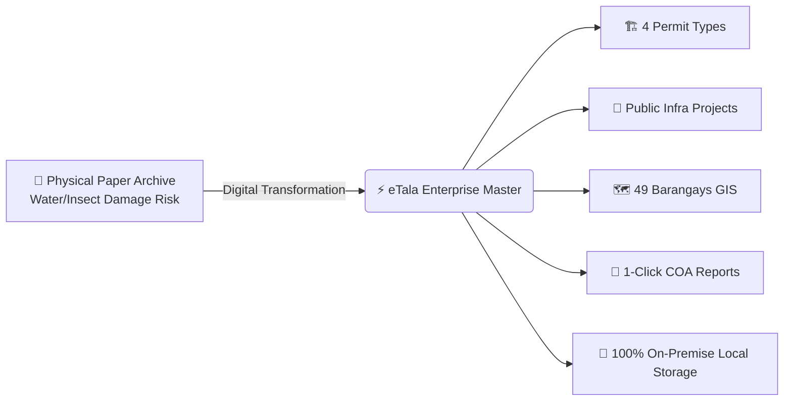
```mermaid
flowchart LR
    A[📂 Physical Paper Archive<br>Water/Insect Damage Risk] -->|Digital Transformation| B(⚡ eTala Enterprise Master)
    B --> C[🏗️ 4 Permit Types]
    B --> D[🌉 Public Infra Projects]
    B --> E[🗺️ 49 Barangays GIS]
    B --> F[📄 1-Click COA Reports]
    B --> G[💾 100% On-Premise Local Storage]
```

### 🔴 Problem Statement (The Legacy Setup)
Prior to eTala, the Carigara Municipal Engineering Office managed thousands of physical building permits, CAD blueprints, and infrastructure folders manually:
1. **Slow Retrieval Times**: Finding historical permits or blueprint plans from past years took hours to days of manually searching physical filing cabinets.
2. **Physical Degradation & Disaster Vulnerability**: Physical paper documents in coastal Leyte are vulnerable to typhoons, floodings, humidity, termites, and accidental misplacement.
3. **Tracking Compliance Gaps**: LGU inspectors had no automated alert system to track expiring Fire Safety (FSIC) certificates, contractor insurance bonds, or pending checklist items.
4. **Disjointed Reporting for Audits**: Preparing Annual Accomplishment Reports for the **Commission on Audit (COA)** or the **Sangguniang Bayan (SB)** required days of manual spreadsheet compilation.

### 🟢 The eTala Solution (Core Objectives)
1. 🗂️ **Zero Misplaced Folders**: 100% centralized digital indexing for all 4 permit types (*Building, Electrical, Occupancy, Fencing*) and public civil works (*Municipal and Barangay*).
2. 🗺️ **Full 49-Barangay Coverage**: Dedicated interactive geospatial mapping and digital workspace for all 49 barangays of Carigara.
3. 📋 **Automated Checklists**: Dynamic requirement slots (*Tax Declarations, Structural Plans, Fire Safety Certificates*) auto-generated per record.
4. 🔍 **Crystal-Clear In-Browser CAD Blueprint Viewer**: Pan, zoom, and inspect high-resolution CAD drawings directly in the web browser without downloading.
5. 📊 **1-Click Print-Ready Reports**: Generates formal PDF and Excel accomplishment reports with official municipal letterheads and tripartite signature blocks.
6. 🔒 **100% Data Sovereignty & Zero Recurring Cost**: Operates entirely on-premise on the LGU's local dedicated server with zero dependency on costly cloud subscriptions.

---

### 🌟 The 9 Standout Capabilities (Plain-Language Guide for Non-Tech Stakeholders & Panelists)

Para sa mga **non-technical users, evaluators, panel members, at opisyal ng munisipyo (Mayor, Municipal Engineer, Encoders)**, narito ang 9 na pinakamahalagang katangian ng eTala sa simpleng salita:

```
┌──────────────────────────────────────────────────────────────────────────────────┐
│              🌟 9 SPECIAL HIGHLIGHT FEATURES (PLAIN LANGUAGE)                    │
├──────────────────────────────────────────────────────────────────────────────────┤
│ 1. 🗺️ Interactive GIS Map       │ Parang "Google Maps" para sa 49 barangays ng   │
│                                  │ Carigara; i-click ang barangay para lumabas    │
│                                  │ lahat ng permits at kalsada doon.              │
├──────────────────────────────────┼────────────────────────────────────────────────┤
│ 2. 🔍 3-Second Live Search       │ Parang Google sa loob ng opisina; mabilis na   │
│                                  │ lumalabas ang resulta habang nagta-type.       │
├──────────────────────────────────┼────────────────────────────────────────────────┤
│ 3. 📋 Automatic Checklist        │ Kusa nang naglalatag ng listahan ng kailangang │
│                                  │ papeles (Plano, Fire Safety, Tax Dec).         │
├──────────────────────────────────┼────────────────────────────────────────────────┤
│ 4. 🔍 In-Browser HD Blueprint    │ Pwedeng i-zoom at silipin ang CAD drawings sa  │
│                                  │ screen nang hindi na kailangang i-download.    │
├──────────────────────────────────┼────────────────────────────────────────────────┤
│ 5. 🔔 30-Day Expiry Reminder     │ 30 days bago mag-expire ang FSIC o insurance   │
│                                  │ bond, tutunog ang bell icon bilang paalala.    │
├──────────────────────────────────┼────────────────────────────────────────────────┤
│ 6. 🖨️ 1-Click Formal COA Reports │ Isang pindot lang, may print-ready PDF na may  │
│                                  │ LGU Seal at linya para sa pirma ng Mayor.      │
├──────────────────────────────────┼────────────────────────────────────────────────┤
│ 7. 🗑️ 30-Day Trash Safety        │ Pag may aksidenteng na-delete, may 30 araw     │
│                                  │ para i-click ang "Restore" at maibalik agad.   │
├──────────────────────────────────┼────────────────────────────────────────────────┤
│ 8. 📱 Multi-Device Work          │ Pwedeng gamitin nang sabay: Desktop sa opisina │
│                                  │ at Tablet sa labas para sa site inspection.    │
├──────────────────────────────────┼────────────────────────────────────────────────┤
│ 9. 🔒 100% On-Premise LGU Server │ Walang buwanang bayad sa cloud at protektado   │
│                                  │ ang pribadong impormasyon ng mga mamamayan.    │
└──────────────────────────────────┴────────────────────────────────────────────────┘
```

> [!TIP]
> ### 🎤 30-Second Oral Defense / Presentation Pitch Script:
> *"Ang eTala ay binuo upang gawing mabilis, moderno, at ligtas sa baha o sunog ang libo-libong dokumento ng Municipal Engineering Office ng Carigara. Sa tulong ng interactive GIS map ng 49 barangays, automated checklists, at 1-click official reports, napabilis natin ang paghahanap ng records mula ilang araw patungo sa 3 segundo lamang — nang walang anumang buwanang bayarin sa cloud dahil 100% itong pinatatakbo sa sariling on-premise server ng LGU."*

---

## 2. 🏛️ Academic / Thesis Manuscript Chapter Mapping (Chapters 1–5)

```
┌────────────────────────────────────────────────────────────────────────┐
│               THESIS / CAPSTONE MANUSCRIPT MAPPING                      │
├─────────────────┬──────────────────────────────────────────────────────┤
│ 📖 Chapter 1    │ • Introduction, Project Context & Objectives         │
│ (Introduction)  │ • Problem Statement & Scope/Delimitations            │
│                 │ • Significance to LGU Carigara & DICT Standards      │
├─────────────────┼──────────────────────────────────────────────────────┤
│ 📚 Chapter 2    │ • Review of Related Literature & Studies (RRL/RRS)   │
│ (RRL & Systems) │ • National Building Code (PD 1096) & PSGC Standards  │
│                 │ • Data Privacy Act (RA 10173) & Electronic Gov Laws  │
├─────────────────┼──────────────────────────────────────────────────────┤
│ 🛠️ Chapter 3    │ • Agile Software Development Lifecycle (SDLC)        │
│ (Methodology)   │ • System Architecture & On-Premise Network Topology  │
│                 │ • Database ERD, Data Dictionary & Security Model     │
├─────────────────┼──────────────────────────────────────────────────────┤
│ 💻 Chapter 4    │ • Results, Discussion & Feature Implementation       │
│ (Results & UI)  │ • Module Walkthroughs, GIS Engine & Report Exports   │
│                 │ • In-Depth System Mechanics & Business Logic Rules   │
│                 │ • User Acceptance Testing (UAT) & Performance Stats │
├─────────────────┼──────────────────────────────────────────────────────┤
│ 🎯 Chapter 5    │ • Summary of Findings, Conclusions & Recommendations │
│ (Conclusion)    │ • Future Expansion (Inter-Office LGU Integration)   │
└─────────────────┴──────────────────────────────────────────────────────┘
```

---

## 3. 💻 System Architecture, Tech Stack & 100% On-Premise Topology

### 3.1 Technology Stack Matrix

| Layer | Technology | Version | Key Purpose |
| :--- | :--- | :--- | :--- |
| **Backend Framework** | **Python / Django** | 5.1+ | Robust MTV architecture, ORM, CSRF/Auth security |
| **Database Engine** | **PostgreSQL / SQLite** | 16+ / 3+ | High-concurrency relational data & zero-latency queries |
| **Frontend Core** | **HTML5, Vanilla CSS3, JavaScript (ES6+)** | Modern | Zero dependency bloat, maximum rendering speed |
| **Mapping Engine** | **Leaflet.js + OpenStreetMap** | 1.9+ | Fast client-side GIS rendering for all 49 barangays |
| **Visualizations** | **Chart.js** | 4.4+ | Interactive annual bar charts & permit distribution doughnuts |
| **Document Engine** | **WeasyPrint / ReportLab & openpyxl** | Latest | Vector PDF rendering with letterheads & multi-sheet Excel |
| **Email Relay** | **Brevo SMTP / Google Workspace** | TLS 587 | 2FA verification codes, password resets & error alerts |

### 3.2 Municipal On-Premise Network Topology

eTala is architected for **100% On-Premise / Local Intranet Hosting** inside the Municipal Hall of Carigara, Leyte:

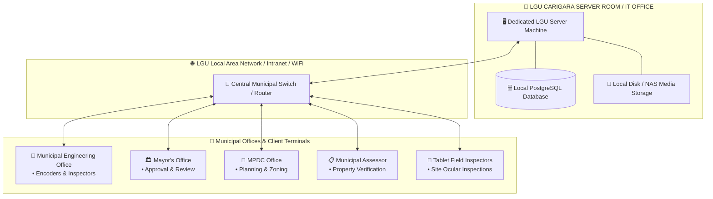
```mermaid
graph TD
    subgraph ServerRoom [🏢 LGU CARIGARA SERVER ROOM / IT OFFICE]
        Host[🖥️ Dedicated LGU Server Machine]
        DB[(🗄️ Local PostgreSQL Database)]
        Storage[💾 Local Disk / NAS Media Storage]
        Host --- DB
        Host --- Storage
    end

    subgraph MunicipalIntranet [🌐 LGU Local Area Network / Intranet / WiFi]
        Switch[🔀 Central Municipal Switch / Router]
        Host <--> Switch
    end

    subgraph OfficeClients [👥 Municipal Offices & Client Terminals]
        MEO[👷 Municipal Engineering Office<br>• Encoders & Inspectors]
        Mayor[🏛️ Mayor's Office<br>• Approval & Review]
        MPDC[📐 MPDC Office<br>• Planning & Zoning]
        Assessor[📋 Municipal Assessor<br>• Property Verification]
        Field[📱 Tablet Field Inspectors<br>• Site Ocular Inspections]

        Switch <--> MEO
        Switch <--> Mayor
        Switch <--> MPDC
        Switch <--> Assessor
        Switch <--> Field
    end
```

---

## 4. 🗄️ Database Schema & Entity-Relationship Architecture (ERD)

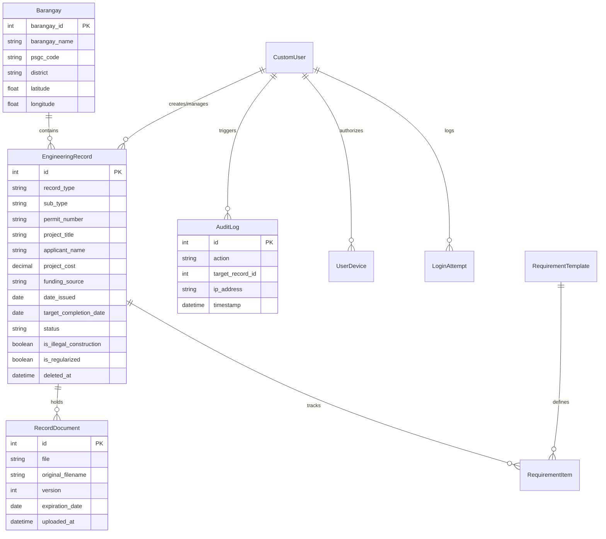
```mermaid
erDiagram
    CustomUser ||--o{ EngineeringRecord : "creates/manages"
    CustomUser ||--o{ AuditLog : "triggers"
    CustomUser ||--o{ UserDevice : "authorizes"
    CustomUser ||--o{ LoginAttempt : "logs"

    Barangay ||--o{ EngineeringRecord : "contains"
    
    EngineeringRecord ||--o{ RecordDocument : "holds"
    EngineeringRecord ||--o{ RequirementItem : "tracks"
    
    RequirementTemplate ||--o{ RequirementItem : "defines"

    Barangay {
        int barangay_id PK
        string barangay_name
        string psgc_code
        string district
        float latitude
        float longitude
    }

    EngineeringRecord {
        int id PK
        string record_type
        string sub_type
        string permit_number
        string project_title
        string applicant_name
        decimal project_cost
        string funding_source
        date date_issued
        date target_completion_date
        string status
        boolean is_illegal_construction
        boolean is_regularized
        datetime deleted_at
    }

    RecordDocument {
        int id PK
        string file
        string original_filename
        int version
        date expiration_date
        datetime uploaded_at
    }

    AuditLog {
        int id PK
        string action
        int target_record_id
        string ip_address
        datetime timestamp
    }
```

---

## 5. 👥 2-Tier Role-Based Access Control (RBAC) & Permission Matrix

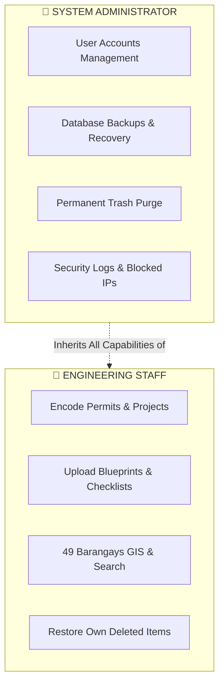
```mermaid
graph TD
    subgraph AdminLevel [👑 SYSTEM ADMINISTRATOR]
        A1[User Accounts Management]
        A2[Database Backups & Recovery]
        A3[Permanent Trash Purge]
        A4[Security Logs & Blocked IPs]
    end
    subgraph StaffLevel [👷 ENGINEERING STAFF]
        S1[Encode Permits & Projects]
        S2[Upload Blueprints & Checklists]
        S3[49 Barangays GIS & Search]
        S4[Restore Own Deleted Items]
    end
    AdminLevel -.->|Inherits All Capabilities of| StaffLevel
```

### 📊 Master Permission Matrix

| 🛠️ System Action / Feature | 👷 Engineering Staff | 👑 System Administrator |
| :--- | :---: | :---: |
| **Encode New Permits, Projects & Violations** | 🟢 **Allowed** | 🟢 **Allowed** |
| **Edit & Update Active Records** | 🟢 **Allowed** | 🟢 **Allowed** |
| **Upload PDF Blueprints & Inspection Photos** | 🟢 **Allowed** | 🟢 **Allowed** |
| **In-Browser Document Preview (Pan/Zoom)** | 🟢 **Allowed** | 🟢 **Allowed** |
| **Search Records & Use 49 Barangays GIS Map** | 🟢 **Allowed** | 🟢 **Allowed** |
| **Export Accomplishment Reports (PDF & Excel)** | 🟢 **Allowed** | 🟢 **Allowed** |
| **Export Single Record / Barangay ZIP Packages** | 🟢 **Allowed** | 🟢 **Allowed** |
| **Move Records to Trash (Soft-Delete)** | 🟢 **Allowed** | 🟢 **Allowed** |
| **Restore Deleted Records ("Trash")** | 🟢 **Allowed** | 🟢 **Allowed** |
| **Restore Other Staff's Records ("All Trash")** | 🔴 *Denied* | 🟢 **Allowed** |
| **Permanent Record Deletion (Early Purge)** | 🔴 *Denied* | 🟢 **Allowed** |
| **Export Municipal Master ZIP (All 49 Barangays)**| 🔴 *Denied* | 🟢 **Allowed** |
| **Create, Edit & Deactivate User Accounts** | 🔴 *Denied* | 🟢 **Allowed** |
| **Database Backups & 1-Click Restoration** | 🔴 *Denied* | 🟢 **Allowed** |
| **Configure LGU Seal & Signatory Settings** | 🔴 *Denied* | 🟢 **Allowed** |
| **Security Audit Logs & Blocked IP Management** | 🔴 *Denied* | 🟢 **Allowed** |

---

## 6. ⚙️ IN-DEPTH SYSTEM MECHANICS & BUSINESS RULES (THE ENCYCLOPEDIA)

This section provides the rigorous technical mechanics, algorithms, triggers, formulas, and exact numbers governing eTala.

---

### 6.1 🔐 Login, Multi-Tier Lockout & IP Blacklist Mechanics

eTala defends municipal records against brute-force attacks and credential stuffing using a **2-Tier Security Lockout Algorithm**:

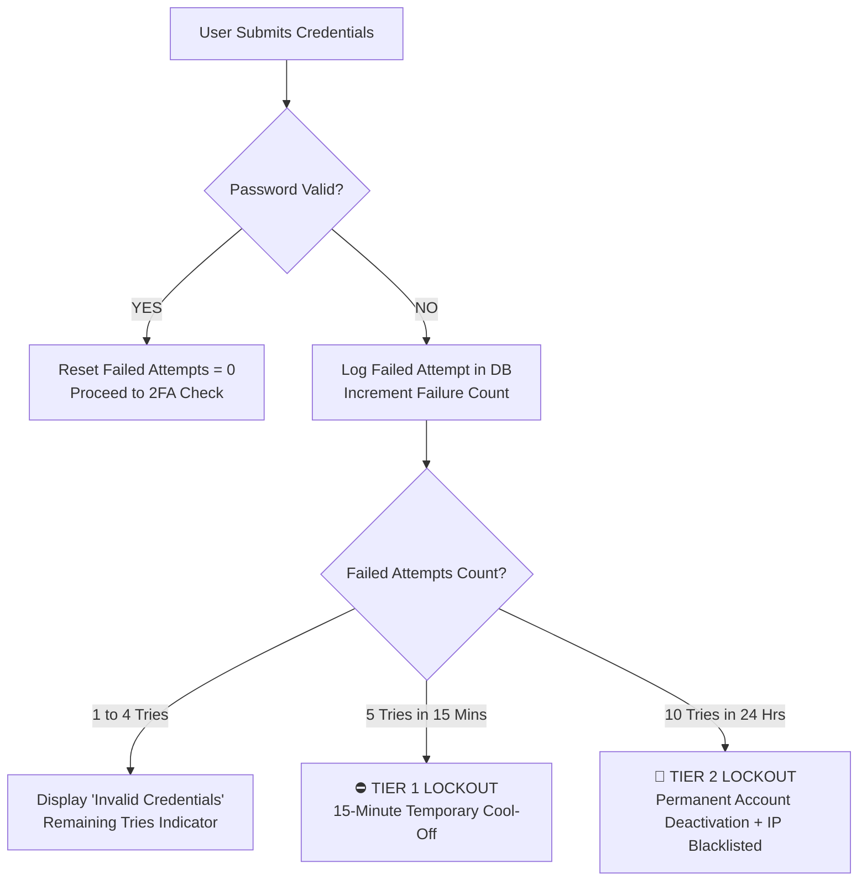
```mermaid
flowchart TD
    A[User Submits Credentials] --> B{Password Valid?}
    B -->|YES| C[Reset Failed Attempts = 0<br>Proceed to 2FA Check]
    B -->|NO| D[Log Failed Attempt in DB<br>Increment Failure Count]
    D --> E{Failed Attempts Count?}
    E -->|1 to 4 Tries| F[Display 'Invalid Credentials'<br>Remaining Tries Indicator]
    E -->|5 Tries in 15 Mins| G[⛔ TIER 1 LOCKOUT<br>15-Minute Temporary Cool-Off]
    E -->|10 Tries in 24 Hrs| H[🚫 TIER 2 LOCKOUT<br>Permanent Account Deactivation + IP Blacklisted]
```

#### 🔢 Exact Lockout Parameters & Auto-Unlock Rules:
1. **Tier 1 (Temporary 15-Minute Lockout)**:
   * **Trigger**: **5 consecutive failed password attempts** within a **15-minute rolling window**.
   * **System Behavior**: The login form locks out the user and displays a countdown timer.
   * **Unlock Methods**:
     * **Auto-Unlock**: Automatically unlocks after **15 minutes** elapse.
     * **Self-Service**: The user clicks *"Forgot Password"* and resets credentials via email.
     * **Admin Intervention**: An Administrator resets the password in `/users/`.
2. **Tier 2 (Permanent Deactivation & IP Blacklist)**:
   * **Trigger**: **10 failed login attempts** within **24 hours**.
   * **System Behavior**:
     * Sets `is_active = False` on the targeted user account.
     * Adds the client IP address to the `BlockedIP` table.
     * Dispatches an urgent security alert to `DEVELOPER_FEEDBACK_EMAILS`.
   * **Unlock Method**: Requires a System Administrator to unblock the IP and manually reactivate the account in the Admin Panel.

---

### 6.2 📧 Email Relay, 2FA OTP & Device Approval Mechanics

All automated emails (2FA OTPs, password resets, security notifications) are dispatched via an encrypted **SMTP Relay (Brevo / Gmail Workspace)** on port `587 (TLS)`:

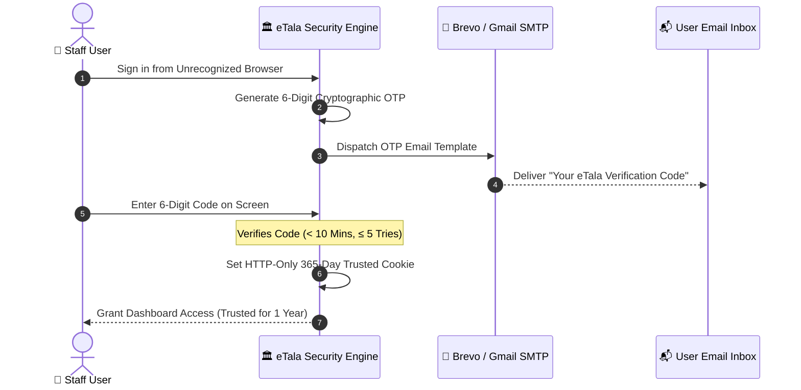
```mermaid
sequenceDiagram
    autonumber
    actor User as 👤 Staff User
    participant System as 🏛️ eTala Security Engine
    participant SMTP as 📨 Brevo / Gmail SMTP
    participant Inbox as 📬 User Email Inbox

    User->>System: Sign in from Unrecognized Browser
    System->>System: Generate 6-Digit Cryptographic OTP
    System->>SMTP: Dispatch OTP Email Template
    SMTP-->>Inbox: Deliver "Your eTala Verification Code"
    User->>System: Enter 6-Digit Code on Screen
    Note over System: Verifies Code (< 10 Mins, ≤ 5 Tries)
    System->>System: Set HTTP-Only 365-Day Trusted Cookie
    System-->>User: Grant Dashboard Access (Trusted for 1 Year)
```

#### 🔢 Email & Verification Constants:
* **2FA OTP Length**: **6 numeric digits** (e.g., `482910`).
* **2FA OTP Lifetime**: **10 minutes** from dispatch.
* **Maximum OTP Retries**: **5 failed attempts** before the OTP code is invalidated.
* **Resend Cooldown Timer**: **60 seconds** to prevent email flooding/spam.
* **Trusted Device Token Lifetime**: **365 Calendar Days (1 Year)** stored in an encrypted, HTTP-only, SameSite cookie.
* **Password Reset Token Lifetime**: **15 minutes** (single-use cryptographic HMAC token).
* **New Device Security Alert**: Instantly sends an email alert containing:
  * Device Name & Browser User-Agent
  * IP Address & Timestamp
  * 1-Click *"Lock My Account"* emergency security link.

---

### 6.3 🗑️ 30-Day Trash, Soft-Delete & Automated Midnight Purge Mechanics

To eliminate the catastrophe of accidental file deletion, eTala implements an **Indestructible 30-Day Soft-Delete Architecture**:

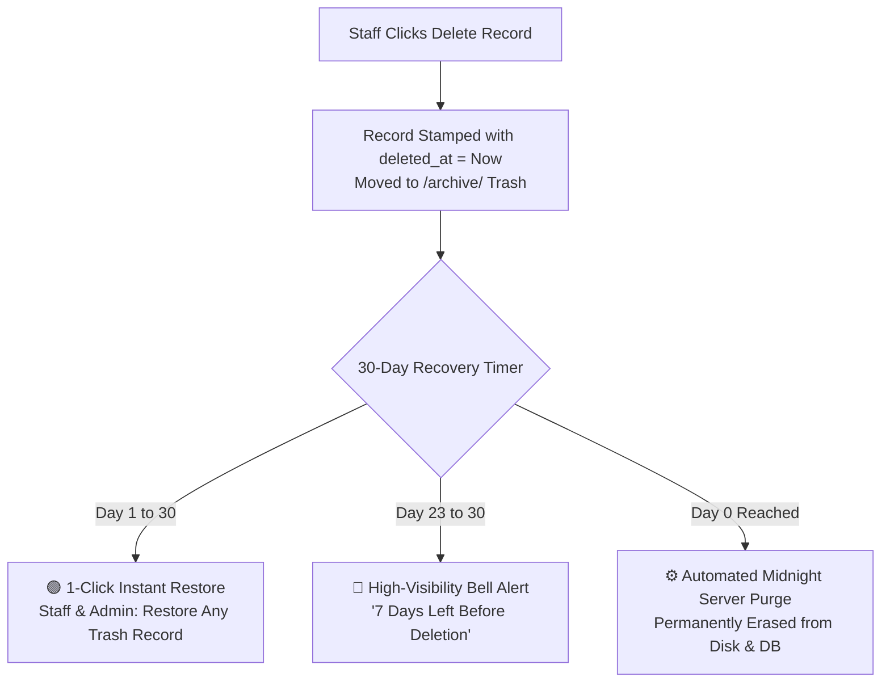
```mermaid
flowchart TD
    A[Staff Clicks Delete Record] --> B[Record Stamped with deleted_at = Now<br>Moved to /archive/ Trash]
    B --> C{30-Day Recovery Timer}
    C -->|Day 1 to 30| D[🟢 1-Click Instant Restore<br>Staff & Admin: Restore Any Trash Record]
    C -->|Day 23 to 30| E[🔔 High-Visibility Bell Alert<br>'7 Days Left Before Deletion']
    C -->|Day 0 Reached| F[⚙️ Automated Midnight Server Purge<br>Permanently Erased from Disk & DB]
```

#### 📐 The 30-Day Recovery Formula:
$$\text{Days Remaining} = \max\left(0, 30 - \left\lfloor\frac{\text{Current Timestamp} - \text{deleted\_at}}{86400}\right\rfloor\right)$$

#### 🔢 Trash Lifecycle Rules:
1. **Soft-Delete**: When moved to trash, the record is NOT erased. The field `deleted_at` is stamped with the current UTC timestamp, immediately hiding it from active modules, GIS maps, and accomplishment reports.
2. **Unified Restore Access**:
   * **Staff**: Can view and restore any soft-deleted record in the Trash repository to support collaborative office workflows.
   * **Admin**: Can view, restore, and permanently hard-delete records.
3. **Automated Midnight Purge Command (`purge_expired_trash`)**:
   * Executes every night at **12:00 AM (Midnight)**.
   * Queries records where `deleted_at <= Now - 30 Days`.
   * Permanently erases the database rows and removes attached PDF files from disk, maintaining server storage hygiene.

---

### 6.4 📁 Document Archiving, 50MB Limits, Versioning (v1 $\rightarrow$ v2) & Signed URLs

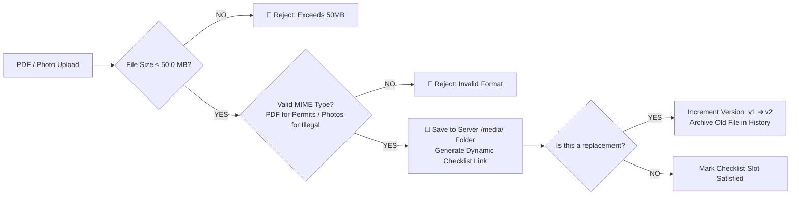
```mermaid
flowchart LR
    Upload[PDF / Photo Upload] --> SizeCheck{File Size ≤ 50.0 MB?}
    SizeCheck -->|NO| ErrSize[🔴 Reject: Exceeds 50MB]
    SizeCheck -->|YES| TypeCheck{Valid MIME Type?<br>PDF for Permits / Photos for Illegal}
    TypeCheck -->|NO| ErrType[🔴 Reject: Invalid Format]
    TypeCheck -->|YES| SaveFile[💾 Save to Server /media/ Folder<br>Generate Dynamic Checklist Link]
    SaveFile --> ReplaceCheck{Is this a replacement?}
    ReplaceCheck -->|YES| IncVersion[Increment Version: v1 ➔ v2<br>Archive Old File in History]
    ReplaceCheck -->|NO| Done[Mark Checklist Slot Satisfied]
```

#### 🔢 Document Specifications:
* **Per-File Size Limit**: **50.0 MB** (accommodates high-resolution multi-page vector CAD drawings).
* **Format Restrictions**:
  * **Permits & Public Projects**: Strictly **PDF (`.pdf`)** to prevent document tampering.
  * **Illegal Construction Violations**: **PDF + Images (`.jpg`, `.jpeg`, `.png`, `.webp`)** for field inspection evidence.
* **Document Versioning (v1 $\rightarrow$ v2)**:
  * Replacing a blueprint automatically increments the version counter (**v1 $\rightarrow$ v2 $\rightarrow$ v3**).
  * The previous version is permanently archived in historical records for legal evidentiary audits.
* **10-Minute Temporary Signed URLs**:
  * In-browser document viewing generates a time-limited HMAC signed token (`/documents/serve/<token>/`).
  * Links expire in **10 minutes**, preventing unauthorized link copying or public leakage.

---

### 6.5 🔔 Expiration Alerts, 30-Day Threshold & Cross-Device Sync Mechanics

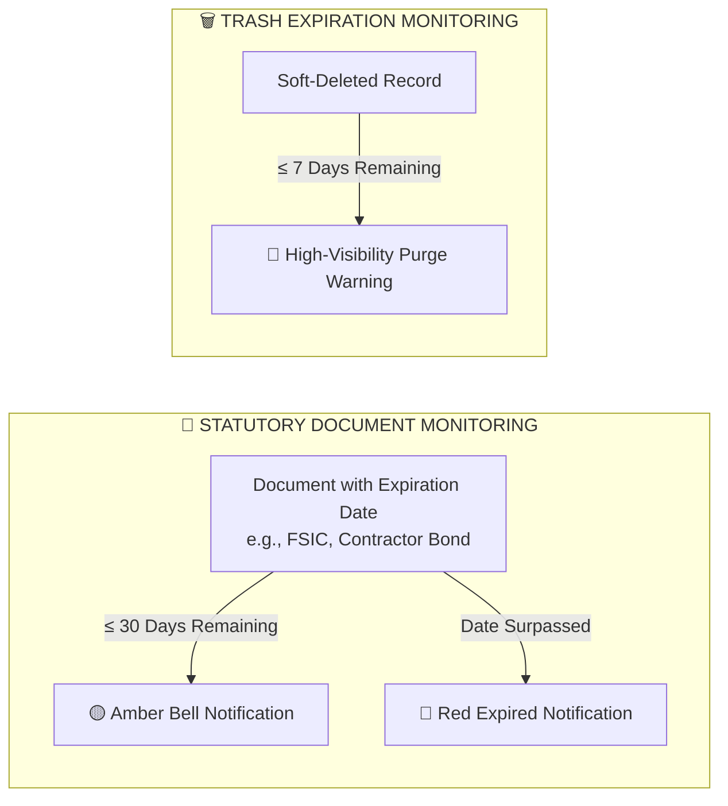
```mermaid
graph LR
    subgraph DocScanning [📄 STATUTORY DOCUMENT MONITORING]
        D1[Document with Expiration Date<br>e.g., FSIC, Contractor Bond] -->|≤ 30 Days Remaining| D2[🟡 Amber Bell Notification]
        D1 -->|Date Surpassed| D3[🔴 Red Expired Notification]
    end
    subgraph TrashScanning [🗑️ TRASH EXPIRATION MONITORING]
        T1[Soft-Deleted Record] -->|≤ 7 Days Remaining| T2[🚨 High-Visibility Purge Warning]
    end
```

#### 🔢 Notification Rules:
1. **Document Expiration (30-Day Window)**:
   * System continuously monitors documents with statutory expiration dates (e.g., Fire Safety Inspection Certificates, Contractor Licenses, Insurance Bonds).
   * Generates notifications when **remaining days $\le$ 30 days**.
   * Uploading an updated replacement document automatically satisfies the requirement and dismisses the alert.
2. **Trash Purge Warning (7-Day Window)**:
   * Generates an urgent warning when an archived record has **$\le$ 7 days** before permanent midnight deletion.
3. **Database-Backed Cross-Device Sync**:
   * Dismissing an alert on your desktop workstation updates your user notification state in the database.
   * When you log in on a field tablet or laptop, dismissed alerts **remain dismissed**.

---

### 6.6 💾 Disaster Recovery, Automated Midnight Backups & 14-Snapshot Rolling Retention

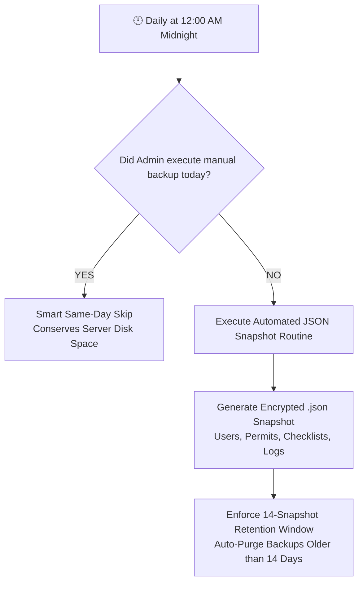
```mermaid
flowchart TD
    Midnight[🕛 Daily at 12:00 AM Midnight] --> CheckSameDay{Did Admin execute manual backup today?}
    CheckSameDay -->|YES| Skip[Smart Same-Day Skip<br>Conserves Server Disk Space]
    CheckSameDay -->|NO| RunBackup[Execute Automated JSON Snapshot Routine]
    RunBackup --> Snapshot[Generate Encrypted .json Snapshot<br>Users, Permits, Checklists, Logs]
    Snapshot --> Retention[Enforce 14-Snapshot Retention Window<br>Auto-Purge Backups Older than 14 Days]
```

#### 🔢 Backup & Recovery Rules:
* **Automated Schedule**: **Daily at 12:00 AM (Midnight)**.
* **Rolling Retention Window**: Retains the **14 most recent daily snapshots** (2 full weeks of rollback history); older snapshot files are automatically pruned to prevent server storage bloat.
* **Smart Same-Day Skip**: If an Admin manually clicks *"Download Backup"* during the day, the automated midnight script detects the fresh backup and skips redundant execution.
* **1-Click Emergency Disaster Recovery**: Uploading a valid `.json` backup file in `/settings/` restores all database tables, user accounts, records, checklists, and audit trails in under **2 minutes**.

---

### 6.7 📊 Accomplishment Computation & COA Compliance Formulas

$$\text{Total Official Accomplishments} = \text{Total Infrastructure Projects} + \text{Total Official Permits Issued}$$

$$\text{Checklist Completion Rate (\%)} = \left(\frac{\text{Fulfilled Required Documents}}{\text{Total Required Documents}}\right) \times 100$$

> [!CAUTION]
> ### ⚖️ Commission on Audit (COA) Compliance Rule
> **Illegal Construction Violations are NEVER counted as positive municipal accomplishments** in official accomplishment reports. They are tracked strictly as administrative enforcement indicators.

---

### 6.8 📜 Tamper-Proof Audit Trail & Reference Linking Mechanics

* **Module**: `/activity-logs/` (Administrators only).
* **Immutable Storage**: Every critical action (login, record creation, modification, soft-deletion, restoration, requirement waiving, document replacement) creates a permanent `AuditLog` row.
* **Exact Log Structure**:
  * **Timestamp**: Exact date and time (`YYYY-MM-DD HH:MM:SS`).
  * **User Account**: Full name and username of the acting employee.
  * **Action**: Human-readable summary (e.g., `Created Building Permit: 2026-06-00001`).
  * **Reference Link**: Direct clickable link (`Ref: Record #42`) navigating instantly to the affected record.
  * **IP Address**: Client network IP address.
* **Anti-Bloat Filter**: Routine background events (page views, thumbnail rendering, ping checks) are automatically excluded to preserve database query speed.

---

### 6.9 🗺️ 49-Barangay GIS Coordinates Persistence Mechanics

* **Module**: `/barangays/`
* Contains all **49 official barangays of Carigara, Leyte** with official Philippine Statistics Authority (PSA) PSGC 10-digit codes.
* **Persistence Guarantee**:
  * In `seed_coordinates.py` and `views.py`, the system checks:
    ```python
    if b.latitude is None or b.longitude is None:
        b.latitude = lat
        b.longitude = lng
    ```
  * Any coordinates modified or adjusted by LGU staff in the Barangay Workspace or Admin Panel are **permanently preserved** in the database and will **never be overwritten** by git pushes, server updates, or redeployments.

---

### 6.10 📱 Multi-Device Session Concurrency, Sliding 14-Day Expiration & Device Tracking

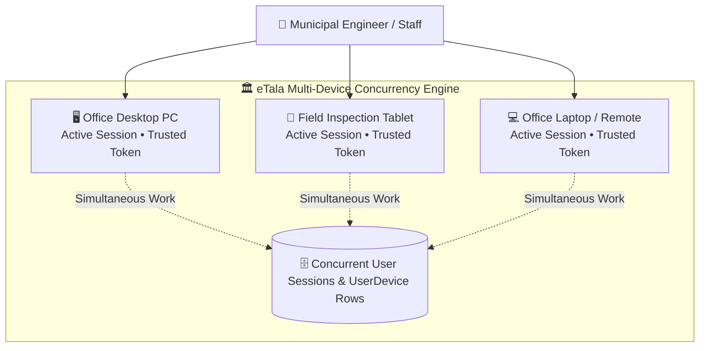
```mermaid
flowchart TD
    User[👤 Municipal Engineer / Staff] --> Dev1[🖥️ Office Desktop PC<br>Active Session • Trusted Token]
    User --> Dev2[📱 Field Inspection Tablet<br>Active Session • Trusted Token]
    User --> Dev3[💻 Office Laptop / Remote<br>Active Session • Trusted Token]

    subgraph ServerAuth [🏛️ eTala Multi-Device Concurrency Engine]
        Dev1 -.->|Simultaneous Work| Engine[(🗄️ Concurrent User Sessions & UserDevice Rows)]
        Dev2 -.->|Simultaneous Work| Engine
        Dev3 -.->|Simultaneous Work| Engine
    end
```

#### 🔢 Session & Concurrency Parameters:
1. **Multi-Device Concurrent Login Support**:
   * eTala **does NOT restrict users to a single device session**.
   * An engineer or inspector can be logged in simultaneously on their **Office Desktop PC**, their **Field Tablet** (during on-site ocular inspections in the barangays), and their **Laptop**.
   * Logging in from a second or third device **will NOT terminate or kick out** active sessions on other workstations.
2. **14-Day Sliding Session Lifetime (`SESSION_COOKIE_AGE = 1209600`)**:
   * Authentication sessions remain active for **14 calendar days (336 hours)**.
   * **Sliding Session Renewal (`SESSION_SAVE_EVERY_REQUEST = True`)**: Every time staff navigate, search, or encode a record, the 14-day expiration clock continuously slides forward. Staff will never experience frustrating mid-day session timeouts while actively working.
3. **Independent Hardware Device Tracking (`UserDevice`)**:
   * Each unique physical computer, tablet, or browser is registered as an independent `UserDevice` record in the database.
   * When signing in from a new machine for the first time, the 2FA OTP email approval flow is triggered.
   * Once approved, that specific hardware receives a **365-Day Trusted Device cryptographic cookie** (`etala_device_trust`), allowing future logins without repeating the OTP step.
   * **Remote Device Revocation**: If a field tablet or laptop is lost or compromised, an Administrator or the user can revoke that specific device's approval in the database, immediately terminating its access without disrupting other office computers.

---

### 6.11 🔍 Records Search Engine, Multi-Token Matching & Column Header Filter Synergy

eTala integrates a dual-tier information retrieval system that combines **Free-Text Search Engine Scanning** with **Excel-Style Column Header Filtering** to deliver instantaneous, zero-delay queries across thousands of historical municipal engineering archives.

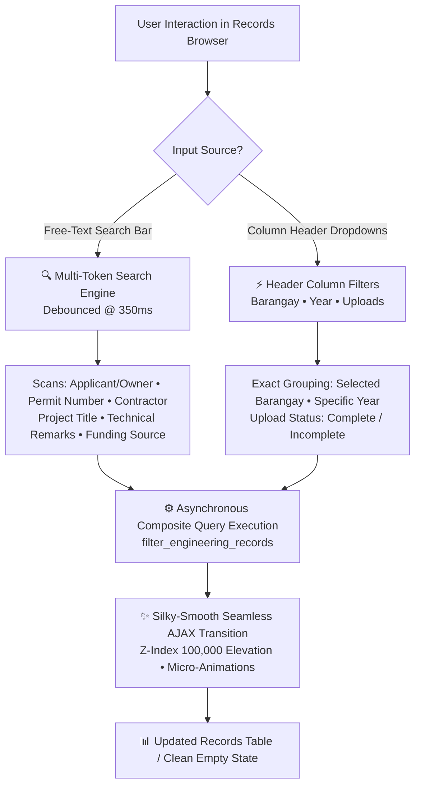
```mermaid
flowchart TD
    Query[User Interaction in Records Browser] --> Decision{Input Source?}
    
    Decision -->|Free-Text Search Bar| SearchEngine[🔍 Multi-Token Search Engine<br>Debounced @ 350ms]
    Decision -->|Column Header Dropdowns| HeaderFilters[⚡ Header Column Filters<br>Barangay • Year • Uploads]
    
    SearchEngine --> SearchFields[Scans: Applicant/Owner • Permit Number • Contractor<br>Project Title • Technical Remarks • Funding Source]
    HeaderFilters --> FilterCriteria[Exact Grouping: Selected Barangay • Specific Year<br>Upload Status: Complete / Incomplete]
    
    SearchFields --> CompositeQuery[⚙️ Asynchronous Composite Query Execution<br>filter_engineering_records]
    FilterCriteria --> CompositeQuery
    
    CompositeQuery --> UIUpdate[✨ Silky-Smooth Seamless AJAX Transition<br>Z-Index 100,000 Elevation • Micro-Animations]
    UIUpdate --> Results[📊 Updated Records Table / Clean Empty State]
```

#### 🔍 1. Free-Text Search Engine Scope (What the Search Bar Scans)
While column filters handle structured groupings (such as location and year), the **Live Search Bar** scans high-entropy textual identifiers and granular engineering parameters that cannot be practically placed into dropdown lists:

1. **Applicant / Property Owner Name**: e.g., `Juan Dela Cruz`, `Mardion Fuerte`, `Santos`
2. **Official Permit Number**: e.g., `#2026-001`, `BP-042`, `EP-109`
3. **Contractor / Construction Entity**: e.g., `ABC Construction`, `By Administration`, `LGU Carigara`
4. **Project Title & Civil Works Keywords**: e.g., `Solar Lights`, `Drainage System`, `Health Center`, `Multi-Purpose Hall`
5. **Technical Remarks & Building Types**: e.g., `Residential 2-Storey`, `Commercial Warehouse`, custom engineering notes
6. **Funding Source**: e.g., `20% Development Fund`, `General Fund`, `LDRRM Fund`

#### ⚡ 2. Dropdown Filters vs. Search Bar Functional Matrix

| Feature / Control | Purpose & Operational Scope | Typical Target Value | Technical Execution |
| :--- | :--- | :--- | :--- |
| **Dropdown Filters**<br>*(Barangay, Year, Uploads)* | Rapid categorical segmentation across discrete database columns. | `Barangay = Canfabi`<br>`Year = 2026`<br>`Uploads = Incomplete` | Exact relational lookup (`Q(barangay_id=...)`, `Q(year=...)`) with auto-sorting for incomplete uploads. |
| **Live Search Bar** | Free-text and multi-word retrieval of dynamic and non-discrete parameters. | `Juan Dela Cruz`<br>`#2026-005`<br>`Solar Lights` | Multi-token composite `AND` query scanning `title`, `applicant_name`, `permit_number`, `contractor`, `remarks`. |
| **Combined Synergy**<br>*(Filters + Search)* | Pinpoint extraction: Filter to a specific locality and status, then search for a specific entity. | *Canfabi* + *Incomplete* + `"Solar"` | Blended relational intersection delivering the exact target record in under 0.2 seconds. |

#### 🛡️ 3. UI/UX Architecture, Transitions & Stacking Defense
* **Simple Basic English Column Menus**: Replaced technical jargon and duplicate sub-sections with standard direct options (`All`, `Complete`, `Incomplete`).
* **Automatic Incomplete Prioritization**: Selecting `Incomplete` automatically arranges records with the lowest fulfillment count at the top, enabling staff to instantly identify records requiring pending document uploads.
* **Stacking Context Defense (`z-index: 100,000`)**: Table header dropdowns dynamically elevate their container layer, preventing underlying table row hover highlights (`tr:hover`) from overlapping or cutting through open menus.
* **Silky-Smooth Micro-Transitions**:
  * Active filter chips pop in with `chipPopIn` and animate out smoothly (`.chip-removing`) when cleared.
  * Table cards transition smoothly (`opacity: 0.50 ➔ 1.0` with `cubic-bezier(0.16, 1, 0.3, 1)` easing) without layout shifts (CLS) or abrupt popups.

---

### 6.12 🕒 "Last Opened / Last Active" Tracking & Workspace Priority Engine

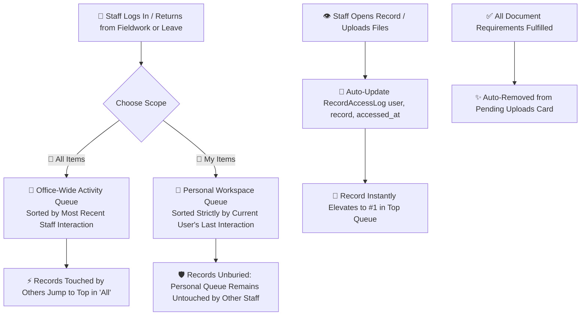
```mermaid
flowchart TD
    A[👤 Staff Logs In / Returns from Fieldwork or Leave] --> B{Choose Scope}
    B -->|🏢 All Items| C[🏢 Office-Wide Activity Queue<br>Sorted by Most Recent Staff Interaction]
    B -->|📂 My Items| D[📂 Personal Workspace Queue<br>Sorted Strictly by Current User's Last Interaction]
    
    C --> E[⚡ Records Touched by Others Jump to Top in 'All']
    D --> F[🛡️ Records Unburied: Personal Queue Remains Untouched by Other Staff]
    
    G[👁️ Staff Opens Record / Uploads Files] --> H[📝 Auto-Update RecordAccessLog user, record, accessed_at]
    H --> I[🚀 Record Instantly Elevates to #1 in Top Queue]
    
    J[✅ All Document Requirements Fulfilled] --> K[✨ Auto-Removed from Pending Uploads Card]
```

#### 🎯 1. Rationale & Problem Addressed (Staff Leave & Fieldwork Backlog Priority)
In traditional date-created sorting systems (`order_by('-created_at')`), if a municipal engineering staff member is away on leave, fieldwork, or training for several weeks or months, their active pending records get buried beneath hundreds of newly encoded records created daily by other staff members.

The **"Last Opened / Last Active" Tracking Engine** solves this critical government workflow bottleneck:
* **Dual Scope Architecture**:
  * **🏢 All Items Scope**: Provides administrative and supervisory oversight. Orders all pending records across the entire Municipal Engineering Office by the most recent timestamp any staff member accessed or modified the record.
  * **📂 My Items Scope**: Isolates the logged-in staff member's personal queue. Orders records that the user *personally opened, edited, or created* by *their own* last access timestamp. Even if months elapse, their personal ongoing files remain right at the top.
* **Graceful Non-Destructive Fallbacks**: Records that have never been opened by a user fall back gracefully to the original creation date (`created_at`), ensuring zero blank rows or missing metadata.
* **Automatic Completion Exclusion**: Once all required checklist items for a record are 100% fulfilled (`is_fulfilled=True`), the record is automatically filtered out of the Pending Uploads card, regardless of how many times it is subsequently opened.

---

## 7. 👤 User Management, Safe Deactivation & Profile Workflows

* **Module**: `/users/` (System Administrators only).
* **Safe Employee Offboarding (`on_delete=models.PROTECT`)**:
  When an employee resigns or transfers, clicking **Deactivate** immediately revokes login privileges while keeping all historical permits, projects, checklists, and audit trail entries created by that employee 100% intact.
* **Self-Service Profile Updates (`/profile/`)**:
  Staff can update their Name, Job Title, Avatar photo, and Password. Updating a work email requires 6-digit OTP verification sent to their current email inbox.

---

## 8. 📊 Executive Dashboard, Visualizations & Topbar Search

* **Module**: `/dashboard/`
* **6 High-Visibility KPI Metric Cards**: Real-time totals of Total Records, Municipal Projects, Barangay Projects, Issued Permits, Incomplete Checklists, and Trash Items.
* **Chart.js Dynamic Visualizations**:
  * **Annual Volume Bar Chart**: Visualizes yearly infrastructure growth and permit issuance across years (1995–Present).
  * **Permit Distribution Doughnut**: Visualizes the breakdown of Building, Electrical, Occupancy, and Fencing permits.
* **Universal 250px Live Search**: Asynchronous multi-token searching debounced at 300ms.
* **Zero-Flicker Theme Switcher**: Dark Navy and Clean White modes stored in `localStorage`.

---

## 9. 📝 Records Encoding, 3-Step Wizard & Bulk Ingestion

* **Method 1: 3-Step Guided Wizard (`/records/new/`)**:
  * **Step 1: Scope & Categorization**: Select category, sub-type, 1 of 49 barangays, and year (1995–Present).
  * **Step 2: Technical & Financial Details**: Permit number, applicant/contractor name, cost (₱), dates, and remarks.
  * **Step 3: Checklist Upload**: Dynamically generated slots for attaching required PDFs.
* **Method 2: Single-Screen Form (`/records/create/`)**: Rapid encoding when all data and attachments are pre-gathered.
* **Method 3: Bulk Data Ingestion (`/records/bulk-encoding/`)**: Multi-row rapid data entry for digitizing historical paper backlogs.

---

## 10. 🏗️ Official Engineering Permits Management (PD 1096)

* **Module**: `/permits/`
* Enforces standard requirements in full compliance with the **National Building Code of the Philippines (Presidential Decree No. 1096)**.
* **4 Permit Types Supported**:
  1. 🏗️ **Building Permit**: Residential, Commercial, Industrial, Institutional, Agricultural.
  2. ⚡ **Electrical Permit**: Wiring installations, temporary service connections, transformer setups.
  3. 🏠 **Occupancy Permit**: Final completion certificates, safety clearances.
  4. 🧱 **Fencing Permit**: Perimeter concrete walls, boundary fences.

---

## 11. 🌉 Municipal & Barangay Infrastructure Projects

* **Modules**: `/municipal/` (Municipal Projects) & `/barangay/` (Barangay Projects).
* **4 Primary Civil Works Types**:
  * 🛣️ **Roads and Bridges**: Concreting, asphalt overlays, box culverts, bridge repairs.
  * 🏢 **Vertical Structures**: Multi-purpose evacuation centers, barangay halls, health clinics, school buildings.
  * 🌊 **Flood Control and Drainage**: River revetments, concrete drainage canals, seawalls.
  * 🚰 **Potable Water Systems**: Level II/III water supply networks, pumping stations, filtration facilities.
* **14 Standard Funding Sources**: `20% Development Fund`, `LGU General Fund`, `Barangay Fund`, `LDRRM Fund`, `Trust Fund`, `National Government Fund`, `DPWH`, `DILG`, `DOH`, `DepEd`, `Private`, `NGO`, `Others`.

---

## 12. 🚨 Illegal Construction Monitoring & Regularization Process

* **Module**: `/illegal-constructions/`
* **Flagging Violations (`/records/flag-illegal/`)**: Pin unpermitted structures on the GIS map, record inspection dates (cannot be in the future), and attach Notice of Violation (NOV) PDFs and field photos (`.jpg`, `.png`, `.webp`).
* **Regularization (`/records/<id>/regularize/`)**: Converts settled violations into legitimate Building Permits upon compliance, while permanently archiving all historical inspection evidence for legal audit.

---

## 13. 📄 Official Accomplishment Reports & Legal Signatures (PDF / Excel)

* **Module**: `/reports/`
* **Print-Ready PDF Reports**: Formatted for Legal (8.5" x 13") and A4 sheets with Republic of the Philippines letterhead, LGU Seal, and tripartite signature blocks:
  * **Prepared by**: Engineering Encoder / Inspector
  * **Verified & Recommending Approval**: Municipal Engineer
  * **Approved by**: Municipal Mayor
* **Multi-Sheet Excel (`.xlsx`)**: Formatted data tables ready for Sangguniang Bayan and Commission on Audit submissions.

---

## 14. 📦 Data Export & Multi-Level ZIP Archival Structures

eTala generates structured, standardized, and clean ZIP archives across individual records, entire barangays, and full municipal repositories.

### 14.1 Single Record ZIP Structure
```
Sanitized_Record_Title_Documents.zip/
├── RECORD_SUMMARY.txt             <-- Clean formatted metadata manifest & checklist tree
├── 01_Building_Plans/             <-- Parent group folder with child blueprints
│   ├── Architectural_Plans.pdf
│   └── Structural_Calculations.pdf
├── 02_Program_of_Works.pdf        <-- Direct leaf document
├── 03_Detailed_Estimates.pdf
├── Supporting_Documents/          <-- Extra affidavits, letters, or site photos
└── Incident_Evidence/             <-- Preserved NOV & inspection photos (for violations)
```

### 14.2 Barangay & Municipal Archive Hierarchy
```
Barangay_Name/
├── BARANGAY_SUMMARY.txt           <-- Master summary of all barangay engineering records
├── 01_Municipal_Projects/         <-- High-value municipal infra in this barangay
├── 02_Barangay_Projects/          <-- Local barangay council funded infrastructure
├── 03_Building_Permits/           <-- Legitimate building & ancillary permits only
└── 04_Illegal_Constructions/      <-- Unpermitted structure violation incident dockets
```

### 14.3 Export Manifest Standards (`RECORD_SUMMARY.txt` / `BARANGAY_SUMMARY.txt` / `MUNICIPAL_SUMMARY.txt`)
* **Standardized Naming**: All summary text files use clean, un-prefixed uppercase naming (`RECORD_SUMMARY.txt`, `BARANGAY_SUMMARY.txt`, `MUNICIPAL_SUMMARY.txt`).
* **Deduplicated Titles**: Formatted cleanly as `Applicant Name (Permit #1234)` or `Project Title` without duplicated applicant labels.
* **Requirement-Grounded Checklist Tree**: Displays official requirement item names with status indicators rather than raw upload filenames:
  * `├── [UPLOADED] Electrical Layout & Plans`
  * `├── [PENDING]  Fire Safety Evaluation Clearance (No file yet)`
  * `└── [N/A]      Locational Clearance (Waived / Not Required)`

---

## 15. 📱 UI Design Systems, Pagination & Ergonomics Guidelines

* **Pagination Standard & Control Aesthetics**:
  * **Uniform Height & Radius**: `30px` box height and `7px` border radius across all page numbers, page size selectors, and arrow controls.
  * **Standard Page Sizes**: `[20, 50, 100, 500]` with `20` as the standard system default.
  * **Zero-Jump Smooth Transitions**: Minimum-height locking (`table-ajax-loading`, `table-ajax-fade-in`) prevents layout shifts, content jumping, and blinking during AJAX pagination and sorting.
* **Audit Trail Lifecycle Accuracy**:
  * The `latest_update_log` property excludes creation (`Created`, `Reported`) and read-only (`Downloaded`, `Exported`, `Viewed`) audit logs, ensuring newly created records only display "CREATED / ENCODED BY" until an actual modification occurs.
* **Mobile Breakpoints**:
  * `320px – 480px`: Wide tables automatically reflow into stacked cards.
  * `768px – 1024px`: Tablet split GIS map & list layout.
  * `1025px – 1280px`: Laptop layout.
  * `1281px – 1920px+`: Full desktop tabular dashboard.
* **Touch Target Standard**: All interactive buttons, icon triggers, and dropdowns maintain a minimum **44px – 48px hitbox**.
* **iOS Zoom Prevention**: Form inputs maintain a minimum `font-size: 16px` to prevent unwanted iOS Safari zooming.
* **Ink-Saving Clean Print (`@media print`)**: Strips dark backgrounds and sidebars, producing clean white paper prints.

---

## 16. ⚖️ Legal & Regulatory Compliance (RA 10173, PD 1096, COA)

| Legal Framework | How eTala Complies |
| :--- | :--- |
| **Data Privacy Act of 2012 (RA 10173)** | On-premise hosting, 10-minute temporary signed URLs, strict 2-tier RBAC, password hashing, 2FA device verification. |
| **National Building Code (PD 1096)** | Standardizes building, electrical, occupancy, and fencing permit checklists and structural approval records. |
| **COA Archival Guidelines** | Immutable audit trails, 30-day soft-delete grace periods, and audit-compliant reporting. |
| **Anti-Red Tape Act (ARTA / RA 11032)** | Accelerates permit retrieval from days to seconds; automated tracking of document completion rates. |

---

## 17. 🧪 System Testing, Verification & Quality Assurance

* **Unit & Integration Test Suite (`permits/tests.py`)**: Covers authentication, 2FA OTP flows, permit creation wizard, document uploads, and report generation.
* **Cross-Browser Testing**: Tested and verified on Google Chrome, Mozilla Firefox, Microsoft Edge, and Apple Safari.

---

## 18. 🗺️ Complete System Master Flowchart Architecture

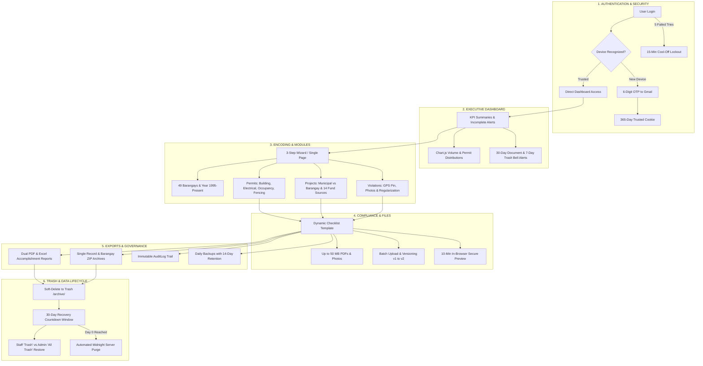
```mermaid
flowchart TD
    subgraph S1 [1. AUTHENTICATION & SECURITY]
        L1[User Login] --> L2{Device Recognized?}
        L2 -->|New Device| L3[6-Digit OTP to Gmail]
        L3 --> L4[365-Day Trusted Cookie]
        L2 -->|Trusted| L5[Direct Dashboard Access]
        L1 -->|5 Failed Tries| L6[15-Min Cool-Off Lockout]
    end

    subgraph S2 [2. EXECUTIVE DASHBOARD]
        L5 --> D1[KPI Summaries & Incomplete Alerts]
        D1 --> D2[Chart.js Volume & Permit Distributions]
        D1 --> D3[30-Day Document & 7-Day Trash Bell Alerts]
    end

    subgraph S3 [3. ENCODING & MODULES]
        D1 --> E1[3-Step Wizard / Single Page]
        E1 --> E2[49 Barangays & Year 1995-Present]
        E1 --> E3[Permits: Building, Electrical, Occupancy, Fencing]
        E1 --> E4[Projects: Municipal vs Barangay & 14 Fund Sources]
        E1 --> E5[Violations: GPS Pin, Photos & Regularization]
    end

    subgraph S4 [4. COMPLIANCE & FILES]
        E3 & E4 & E5 --> C1[Dynamic Checklist Template]
        C1 --> C2[Up to 50 MB PDFs & Photos]
        C1 --> C3[Batch Upload & Versioning v1 to v2]
        C1 --> C4[10-Min In-Browser Secure Preview]
    end

    subgraph S5 [5. EXPORTS & GOVERNANCE]
        C1 --> G1[Dual PDF & Excel Accomplishment Reports]
        C1 --> G2[Single Record & Barangay ZIP Archives]
        C1 --> G3[Immutable AuditLog Trail]
        C1 --> G4[Daily Backups with 14-Day Retention]
    end

    subgraph S6 [6. TRASH & DATA LIFECYCLE]
        G1 & G2 --> T1[Soft-Delete to Trash /archive/]
        T1 --> T2[30-Day Recovery Countdown Window]
        T2 --> T3[Staff 'Trash' vs Admin 'All Trash' Restore]
        T2 -->|Day 0 Reached| T4[Automated Midnight Server Purge]
    end
```

---

## 19. 🎯 System Scope, Delimitations & Target Beneficiaries (Chapter 1)

### 19.1 Comprehensive Scope of the System (Saklaw ng Sistema)

Ang saklaw ng eTala ay nakapokus sa pagiging sentralisadong digital archiving, geospatial mapping, at compliance management platform para sa **Municipal Engineering Office (MEO) ng LGU Carigara, Leyte**:

#### A. Functional Scope (Mga Saklaw na Modulo at Gamit)
1. **Four (4) Official Engineering Permits (PD 1096)**:
   * **Building Permits**: *Residential, Commercial, Industrial, Institutional, Agricultural*.
   * **Electrical Permits**: *Wiring installations, temporary/permanent power connections, transformer setups*.
   * **Occupancy Permits**: *Certificates of Occupancy, final structural completion inspections*.
   * **Fencing Permits**: *Perimeter concrete walls, boundary enclosures*.
2. **Public Infrastructure Civil Works Projects**:
   * **Municipal Projects**: *Mga proyektong pinondohan ng Munisipyo (e.g., Public Market, Municipal Hall, Flood Control)*.
   * **Barangay Projects**: *Mga proyektong pinondohan ng Barangay Development Fund (e.g., Barangay Pathways, Multi-Purpose Halls)*.
   * **14 Funding Source Classifications**: *20% Development Fund, LGU General Fund, Barangay Fund, LDRRM Fund, DPWH, DILG, DOH, DepEd, atbp.*
3. **Illegal Construction Monitoring & Regularization**:
   * Pag-flag ng unpermitted structures sa GIS map, pagtala ng Notice of Violation (NOV), pagkakabit ng site inspection photos, at pag-convert (*Regularization*) patungo sa lehitimong Building Permit.
4. **Dynamic Checklist & Document Archiving**:
   * Awtomatikong paglalatag ng kailangang dokumento (*Tax Declarations, Structural Plans, Fire Safety Clearances*).
   * Suporta hanggang **50.0 MB bawat file** para sa malalaking vector CAD blueprints.
   * **In-Browser Blueprint Viewer**: Pan, zoom, at pagsusuri ng blueprints nang hindi kailangang i-download sa computer.
   * **Document Versioning (v1 $\rightarrow$ v2)**: Pag-archive ng lumang bersyon ng plano sa kasaysayan ng record para sa legal audit.

#### B. Geographical Scope (Heograpikal na Saklaw)
* Sakop ang **lahat ng 49 Opisyal na Barangay ng Carigara, Leyte** batay sa Philippine Standard Geographic Code (PSGC 10-digit codes) ng Philippine Statistics Authority (PSA).
* Nahahati sa dalawang (2) administrative districts: **Poblacion** (7 barangays) at **Rural** (42 barangays).
* Bawat barangay ay may sariling **interactive GIS centroid map pin** at digital workspace na may persistent database coordinates.

#### C. Temporal / Time Horizon Scope (Saklaw ng Taon)
* Sumusuporta sa pag-encode ng mga historical paper backlogs mula **Taong 1995 hanggang sa Kasalukuyan (Present Year)**.

#### D. User Roles & Security Scope (Saklaw ng Gumagamit at Seguridad)
* **2-Tier Role-Based Access Control (RBAC)**:
  * **Engineering Staff**: Encoders, inspectors, at clerks para sa daily encoding, uploading, at report generation.
  * **System Administrator**: IT Officers at Municipal Engineer para sa account management, database backups, at trash purging.
* **Security Subsystem**:
  * 2-Tier brute-force lockout (5 failed tries $\rightarrow$ 15 min cool-off; 10 failed tries $\rightarrow$ permanent lock + IP blacklist).
  * 2FA Email OTP sa mga bagong devices na may 365-day trusted device token.
  * Multi-device concurrent login na may 14-day sliding session duration.
  * 10-minute temporary signed HMAC URLs para sa ligtas na pagtingin ng dokumento.

#### E. Reporting & Auditing Scope (Saklaw ng Ulat at Pag-audit)
* **1-Click Official Accomplishment Reports**:
  * **PDF Export**: Nakadisenyo para sa Legal (8.5" x 13") at A4 sheets na may LGU Carigara Seal at tripartite signature block (*Prepared by Encoder, Verified by Municipal Engineer, Approved by Mayor*).
  * **Multi-Sheet Excel Export (`.xlsx`)**: Handa para sa pagsusuri ng Sangguniang Bayan at Commission on Audit (COA).
* **Immutable Audit Trail (`AuditLog`)**: Tamper-proof logging ng lahat ng account actions na may clickable reference links.

#### F. Disaster Recovery & Retention Scope (Saklaw ng Backup at Pagbura)
* **30-Day Trash Grace Period**: Soft-deleted records ay may 30 calendar days recovery window bago awtomatikong i-purge.
* **Automated Midnight Backups**: Araw-araw na `.json` snapshot na may **14-snapshot rolling retention window**.

#### G. Target Beneficiaries
1. **Municipal Engineering Office (MEO)**: Encoders, inspectors, at evaluators na nagpoproseso ng araw-araw na permits at infrastructure records.
2. **Municipal Engineer & Building Official**: Sumusuri ng compliance rates, nag-aapruba ng permits, at lumalagda sa accomplishment reports.
3. **Municipal Mayor & Sangguniang Bayan**: Tumatanggap ng accurate accomplishment matrices para sa municipal planning at budgeting.
4. **Commission on Audit (COA)**: Nagsasagawa ng formal auditing gamit ang tamper-proof logs at kumpletong municipal project records.

---

### 19.2 Explicit Delimitations of the System (Mga Limitasyon at Labas sa Saklaw)

Upang maiwasan ang maling ekspektasyon at maipagtanggol ang hangganan ng pag-aaral sa harap ng defense panel:

1. **Hindi Online Public Citizen Payment Gateway**:
   * Ang eTala ay isang **panloob (internal) na management at archiving platform** ng MEO. Hindi ito tumatanggap ng direktang bayad mula sa publiko gamit ang Credit Card, GCash, o Maya para sa regulatory permit fees (ang pagbabayad ng regulatory fees ay nananatili sa Municipal Treasurer's Office).
2. **Hindi Public Open-Access Portal**:
   * Ang system ay accessible lamang sa mga awtorisadong kawani ng munisipyo na may rehistradong account. Ang mga pribadong mamamayan ay hindi pwedeng mag-login o mag-browse ng blueprints ng ibang tao (alinsunod sa Data Privacy Act RA 10173).
3. **Hindi 3D Architectural CAD Modeling Software**:
   * Ang built-in viewer ay nagpapakita, nagzu-zoom, at sumusuri ng vector PDF CAD drawings. **Hindi ito nagmo-modify o nag-e-edit ng mismong DWG/CAD wireframe models**.
4. **Delimited Lamang sa LGU Carigara, Leyte**:
   * Ang geospatial map boundaries, barangay PSGC master list, at structural project workflows ay naka-calibrate eksklusibo para sa Munisipalidad ng Carigara lamang.
5. **Hindi Awtomatikong Pumapalit sa Pirma ng Lisensyadong Inhinyero**:
   * Ang eTala ay tagapagtala at tagasuri ng compliance checklists. Ang legal at propesyonal na pananagutan sa structural stability ng mga plano ay nananatili sa lisensyadong Civil/Structural Engineer na pumirma sa pisikal na plano.
6. **100% On-Premise Local Intranet Hosting**:
   * Idinisenyo ang system upang tumakbo sa sariling local server ng Munisipyo at ma-access sa pamamagitan ng LGU Local Area Network (LAN/Intranet). Hindi ito gumagamit ng third-party public cloud hosting (tulad ng AWS, Render, o Supabase) upang makatipid sa buwanang gastusin at mapanatili ang data sovereignty.

---

## 20. 📖 Operational Definition of Terms (Chapter 1)

* **ERARMS (Engineering Records Archiving and Retrieval Management System)**: The dedicated web platform engineered for digitizing, indexing, storing, and retrieving municipal civil works documents.
* **National Building Code (PD 1096)**: The governing Philippine law setting structural, safety, and permit standards for all vertical and horizontal constructions.
* **PSGC (Philippine Standard Geographic Code)**: The official 10-digit numerical coding system developed by the Philippine Statistics Authority (PSA) to uniquely identify barangays.
* **2FA (Two-Factor Authentication)**: A secondary security layer requiring a 6-digit email OTP when signing in from an unrecognized computer or mobile browser.
* **Soft-Delete**: An archiving mechanism where deleted records are stamped with a timestamp (`deleted_at`) and hidden from view while granting a 30-day grace period before permanent erasure.
* **Regularization**: The administrative process of converting an unpermitted or illegal construction violation into an approved Building Permit upon fulfillment of technical requirements and penalty settlements.
* **On-Premise Hosting**: The deployment of software and database infrastructure entirely on physical hardware servers physically located inside the LGU Carigara Municipal Hall.

---

## 21. 📊 ISO/IEC 25010 Software Quality Evaluation Framework (Chapter 4)

To evaluate the system's software quality, eTala is measured against the **ISO/IEC 25010 Software Engineering Quality Model**:

```
┌──────────────────────────────────────────────────────────────────────────────────┐
│                 ISO/IEC 25010 QUALITY EVALUATION CRITERIA                        │
├──────────────────────────┬───────────────────────────────────────────────────────┤
│ 1. Functional            │ • Completeness of all 4 permit workflows              │
│    Suitability           │ • Accurate calculation of accomplishment totals       │
│                          │ • Dynamic generation of requirement checklist slots   │
├──────────────────────────┼───────────────────────────────────────────────────────┤
│ 2. Performance           │ • Sub-second (≤ 300ms) live debounced search          │
│    Efficiency            │ • Fast streaming of 50MB CAD blueprint files          │
│                          │ • Zero memory leaks during multi-tab browsing         │
├──────────────────────────┼───────────────────────────────────────────────────────┤
│ 3. Usability             │ • Clean 3-Step guided encoding wizard for non-tech    │
│                          │ • Dark/Light theme switching with zero page flicker   │
│                          │ • Intuitive 49-barangay interactive GIS map pins      │
├──────────────────────────┼───────────────────────────────────────────────────────┤
│ 4. Reliability           │ • 30-day recovery grace window for deleted files      │
│                          │ • Automated midnight database backup routine          │
│                          │ • Zero data loss on abrupt browser closure            │
├──────────────────────────┼───────────────────────────────────────────────────────┤
│ 5. Security              │ • 2-tier brute-force lockout & IP blacklisting        │
│                          │ • 2FA device approval OTP via encrypted SMTP relay    │
│                          │ • 10-minute temporary signed URLs for file viewing    │
├──────────────────────────┼───────────────────────────────────────────────────────┤
│ 6. Maintainability       │ • Modular Django MTV code separation                  │
│                          │ • Clean data dictionary & relational migrations       │
│                          │ • Detailed operational documentation manual           │
├──────────────────────────┼───────────────────────────────────────────────────────┤
│ 7. Portability           │ • Responsive across Desktop, iPad/Tablet, and Mobile  │
│                          │ • Cross-browser support (Chrome, Firefox, Edge, Safari)│
│                          │ • Clean print media styling (@media print)            │
└──────────────────────────┴───────────────────────────────────────────────────────┘
```

---

## 22. 🖥️ Minimum & Recommended Hardware/Software Specifications (Chapter 3)

### 22.1 On-Premise LGU Server Specifications
| Component | Minimum Specification | Recommended Specification |
| :--- | :--- | :--- |
| **Processor (CPU)** | Intel Core i3 (8th Gen) / AMD Ryzen 3 | Intel Core i5/i7 (10th+ Gen) or AMD Ryzen 5/7 |
| **Memory (RAM)** | 8.0 GB DDR4 | 16.0 GB – 32.0 GB DDR4 |
| **Storage (Disk)** | 256 GB SSD (for OS + Database) | 1.0 TB NVMe SSD + 2.0 TB HDD (for CAD PDFs) |
| **Operating System** | Ubuntu Linux 22.04 LTS / Windows 10/11 Pro | Ubuntu Server 24.04 LTS |
| **Local Network** | 100 Mbps Local Intranet Router | 1.0 Gbps (Gigabit) Managed Municipal Switch |

### 22.2 Client / Workstation Specifications (Office PCs & Tablets)
| Component | Minimum Specification | Recommended Specification |
| :--- | :--- | :--- |
| **Client Devices** | Desktop PC, Laptop, or Android/iOS Tablet | Desktop PC (1080p Monitor) & 10" Android Tablet |
| **Web Browser** | Google Chrome 100+, MS Edge 100+, Firefox | Google Chrome Latest (Stable) |
| **Display Resolution** | 1366 x 768 pixels | 1920 x 1080 pixels (Full HD) |

---

## 23. 🗃️ Complete Data Dictionary & Database Table Specifications (Chapter 3)

### Table 1: `permits_engineeringrecord`
| Field Name | Data Type | Nullable | Description |
| :--- | :--- | :---: | :--- |
| `id` | BigAutoField (PK) | ❌ No | Unique internal numerical identifier. |
| `record_type` | VarChar(50) | ❌ No | Category (`permit`, `municipal_project`, `barangay_project`, `illegal_construction`). |
| `sub_type` | VarChar(100) | ❌ No | Sub-classification (e.g., `Building Permit`, `Roads and Bridges`). |
| `permit_number` | VarChar(100) | ❌ No | Official serial identifier (e.g., `2026-06-00001`). |
| `project_title` | VarChar(255) | ❌ No | Full name or descriptive title of project/structure. |
| `applicant_name`| VarChar(255) | ❌ No | Property owner, applicant, or assigned contractor. |
| `project_cost` | Decimal(15,2)| ❌ No | Budget or estimated cost in Philippine Pesos (₱). |
| `funding_source`| VarChar(100) | ❌ No | Source of budget (e.g., `20% Development Fund`, `LGU General Fund`). |
| `barangay_id` | Integer (FK) | ❌ No | Relational reference to `permits_barangay`. |
| `year` | Integer | ❌ No | Archival year (between 1995 and Current Year). |
| `date_issued` | Date | ❌ No | Formal grant or inspection date. |
| `is_illegal` | Boolean | ❌ No | Flag indicating if record is an unpermitted violation. |
| `is_regularized`| Boolean | ❌ No | Flag indicating if violation was converted to a permit. |
| `deleted_at` | DateTime | ✔️ Yes | Timestamp for 30-day soft-delete trash recovery. |

### Table 2: `permits_barangay`
| Field Name | Data Type | Nullable | Description |
| :--- | :--- | :---: | :--- |
| `barangay_id` | AutoField (PK) | ❌ No | Unique barangay database identifier. |
| `barangay_name`| VarChar(150) | ❌ No | Official Philippine PSA name of the barangay. |
| `psgc_code` | VarChar(20) | ✔️ Yes | Official 10-digit PSA Geographic Code. |
| `district` | VarChar(50) | ❌ No | `Poblacion` or `Rural` administrative cluster. |
| `latitude` | Float | ✔️ Yes | GPS Centroid Latitude coordinate (persistent). |
| `longitude` | Float | ✔️ Yes | GPS Centroid Longitude coordinate (persistent). |

### Table 3: `permits_recorddocument`
| Field Name | Data Type | Nullable | Description |
| :--- | :--- | :---: | :--- |
| `id` | BigAutoField (PK) | ❌ No | Unique document file identifier. |
| `record_id` | Integer (FK) | ❌ No | Relational reference to parent `EngineeringRecord`. |
| `requirement_id`| Integer (FK) | ✔️ Yes | Relational reference to `RequirementItem`. |
| `file` | FileField | ❌ No | Local server file path (stored in `/media/`). |
| `version` | Integer | ❌ No | Version counter (v1, v2, v3) for audit integrity. |
| `expiration_date`| Date | ✔️ Yes | Expiry date for statutory clearances (FSIC, bonds). |
| `uploaded_at` | DateTime | ❌ No | Exact upload timestamp. |

### Table 4: `permits_recordaccesslog`
| Field Name | Data Type | Nullable | Description |
| :--- | :--- | :---: | :--- |
| `id` | BigAutoField (PK) | ❌ No | Unique record access log identifier. |
| `user_id` | Integer (FK) | ❌ No | Relational reference to `CustomUser` who viewed/opened the record. |
| `record_id` | Integer (FK) | ❌ No | Relational reference to `EngineeringRecord`. |
| `accessed_at` | DateTime | ❌ No | Exact timestamp when record was viewed or modified (auto-updated on interaction). |

---

## 24. 🛡️ Risk Management, Threat Matrix & Contingency Plan (Chapter 3/5)

```
┌──────────────────────────────────────────────────────────────────────────────────┐
│                     RISK ASSESSMENT & CONTINGENCY MATRIX                         │
├────────────────────┬──────────┬──────────────────────────────────────────────────┤
│ Identified Risk    │ Severity │ System Mitigation & Contingency Plan             │
├────────────────────┼──────────┼──────────────────────────────────────────────────┤
│ ⚡ Power Outage /   │ Moderate │ • Uninterruptible Power Supply (UPS) on server   │
│    Brownout        │          │ • SQLite/PostgreSQL transactional write safety   │
│                    │          │ • Browser auto-draft local recovery              │
├────────────────────┼──────────┼──────────────────────────────────────────────────┤
│ 🗑️ Accidental File │ High     │ • 30-day soft-delete recovery grace period       │
│    Deletion        │          │ • Role-segregated Trash restoring                │
│                    │          │ • Daily automated midnight JSON backups          │
├────────────────────┼──────────┼──────────────────────────────────────────────────┤
│ 🔐 Brute-Force     │ High     │ • 5-try / 15-minute Tier 1 temporary lockout     │
│    Password Attack │          │ • 10-try / 24h Tier 2 account deactivation       │
│                    │          │ • Automated client IP address blacklisting       │
├────────────────────┼──────────┼──────────────────────────────────────────────────┤
│ 🌊 Typhoon / Water │ Extreme  │ • Digital transition eliminates paper water loss │
│    Damage (Calamity│          │ • 1-click external USB / NAS offsite backup      │
│                    │          │ • Fast 2-minute disaster recovery restoration    │
├────────────────────┼──────────┼──────────────────────────────────────────────────┤
│ 📱 Hardware Loss / │ Moderate │ • Immediate remote revocation of UserDevice token│
│    Stolen Tablet   │          │ • Mandatory 2FA OTP verification on new devices  │
└────────────────────┴──────────┴──────────────────────────────────────────────────┘
```

---

## 25. 🎓 Capstone Defense Strategy, Feature Justification & Non-IT Panel Q&A Guide

Para sa **Capstone Oral Defense**, narito ang kumpletong gabay gamit ang **simpleng salita, mga totoong halimbawa (analogies), at matibay na batayan sa batas** upang maipaliwanag sa kahit sinong panelist (IT man o non-IT tulad ng mga civil engineers, deans, at opisyal ng munisipyo) kung bakit naririto ang bawat feature ng **eTala**:

```
┌───────────────────────────────────────────────────────────────────────────────────────────────────┐
│              🏛️ MASTER SUMMARY: BAKIT NILAGAY ANG MGA FEATURES NA ITO? (PLAIN LANGUAGE)           │
├────────────────────────────────┬──────────────────────────────────────────────────────────────────┤
│ Feature sa System              │ 💡 Simpleng Paliwanag / Real-World Analogy (Pang-Non-IT)         │
├────────────────────────────────┼──────────────────────────────────────────────────────────────────┤
│ 1. 🕒 "Last Opened" Sorting    │ Parang personal desk sa opisina: ang huli mong hinawakan ang     │
│                                │ nasa ibabaw. Hindi matatabunan ang files mo kahit mag-leave ka.  │
├────────────────────────────────┼──────────────────────────────────────────────────────────────────┤
│ 2. 🌓 Dark Mode & Light Mode   │ Parang reading mode sa cellphone: binabawasan ang silaw para     │
│                                │ hindi sumakit ang mata ng staff na 8 oras nakatitig sa screen.   │
├────────────────────────────────┼──────────────────────────────────────────────────────────────────┤
│ 3. 👤 Profile Picture / Avatar │ Parang picture sa ID card: sa isang sulyap sa logbook, alam agad │
│                                │ kung sinong staff ang nag-upload o nag-edit ng dokumento.        │
├────────────────────────────────┼──────────────────────────────────────────────────────────────────┤
│ 4. 🗑️ 30-Day Trash Soft-Delete│ Parang safety net: bawal sunugin agad ang dokumento ng gobyerno. │
│                                │ May 30 days para bawiin kung aksidenteng napindot ang delete.    │
├────────────────────────────────┼──────────────────────────────────────────────────────────────────┤
│ 5. 📋 Standard Checklist Slots │ Parang checklist sa bangko: nakalista na agad ang 11 requirements│
│                                │ para patas sa lahat ng aplikante at walang red tape (RA 11032).  │
├────────────────────────────────┼──────────────────────────────────────────────────────────────────┤
│ 6. 🛡️ Device Approval & OTP    │ Parang security guard sa pinto: kahit alam ng iba ang password,  │
│                                │ kung hindi rehistrado ang computer nila sa LGU, bawal pumasok.   │
├────────────────────────────────┼──────────────────────────────────────────────────────────────────┤
│ 7. 💾 1-Click ZIP Backup       │ Parang master copy sa safe box: kung magkabaha o masira ang PC,  │
│                                │ maibabalik ang buong opisina sa loob ng 2 minuto (COA standard). │
├────────────────────────────────┼──────────────────────────────────────────────────────────────────┤
│ 8. 🗺️ 49-Barangay GIS Map      │ Parang Google Maps ng Carigara: i-click ang barangay para makita │
│                                │ agad ang lahat ng kalsada, tulay, at permits sa lugar na iyon.   │
├────────────────────────────────┼──────────────────────────────────────────────────────────────────┤
│ 9. 🚨 Illegal Construction Log │ Parang traffic ticket system: hinuhuli at tinutulungang maging   │
│                                │ legal ang mga nagtayo ng gusali nang walang building permit.     │
├────────────────────────────────┼──────────────────────────────────────────────────────────────────┤
│ 10. 📄 1-Click COA PDF Reports │ Parang automated typewriter: 1 click lang, may pormal na monthly │
│                                │ accomplishment report na may opisyal na signature lines.        │
├────────────────────────────────┼──────────────────────────────────────────────────────────────────┤
│ 11. 🔍 HD In-Browser Viewer    │ Parang magnifying glass sa screen: pwedeng i-zoom ang blueprint  │
│                                │ drawings nang hindi na kailangang bumili ng mamahaling AutoCAD.  │
├────────────────────────────────┼──────────────────────────────────────────────────────────────────┤
│ 12. 🔔 30-Day Expiry Bell      │ Parang alarm clock: tutunog 30 days bago mapaso ang Fire Safety  │
│                                │ certificate o insurance para masabihan agad ang may-ari.         │
├────────────────────────────────┼──────────────────────────────────────────────────────────────────┤
│ 13. ⚡ 3-Second Live Search    │ Parang Google sa loob ng munisipyo: habang nagta-type ka ng      │
│                                │ pangalan o permit number, lumalabas agad ang record.             │
├────────────────────────────────┼──────────────────────────────────────────────────────────────────┤
│ 14. 📝 3-Step Wizard Form      │ Parang interview form: hinati sa 3 madadaling hakbang para hindi │
│                                │ magkamali o malito ang staff sa pag-encode ng makakapal na files.│
├────────────────────────────────┼──────────────────────────────────────────────────────────────────┤
│ 15. 🔌 REST API & Mobile Ready │ Parang universal adapter: handa nang ikabit sa tablet app ng mga │
│                                │ inspectors sa Phase 2 nang hindi na binabago ang database.       │
└────────────────────────────────┴──────────────────────────────────────────────────────────────────┘
```

---

### 🎙️ Kumpletong Gabay sa Pagsagot sa Panel (Oral Defense Scripts)

#### 1. 🕒 Bakit "Last Opened" ang sorting sa halip na Date Created sa Pending Uploads?
* **Pang-Non-IT na Paliwanag:**
  > *"Sir/Ma'am, isipin po natin ang mesa ng isang empleyado. Kapag nag-leave siya ng 1 buwan o nag-field inspection, tapos bumalik siya sa opisina, gusto niya na ang mga dokumentong hawak niya ay nasa ibabaw pa rin ng mesa niya.*
  > 
  > *Kung **Date Created** ang gagamitin natin, matatabunan sa pinakailalim ang mga dati niyang ginagawa dahil sa daan-daang bagong records na ginawa ng ibang staff habang wala siya. Sa pamamagitan ng **'Last Opened'**, kapag pinindot niya ang **'My Items'**, tanging ang mga files na siya mismo ang huling humawak ang lilitaw sa itaas. At kapag kumpleto na ang uploads, kusa itong mawawala sa pending list."*

---

#### 2. 🌓 Bakit may Dark Mode at Light Mode? (Hindi ba pampapogi lang 'yan?)
* **Pang-Non-IT na Paliwanag:**
  > *"Sir/Ma'am, para po ito sa **kalusugan ng mata ng mga empleyado (Ergonomics & Anti-Eye Strain)**. Ang mga kawani ng Municipal Engineering Office ay 8 oras bawat araw na nakatitig sa screen habang nagbabasa ng maliliit na sukat sa blueprints at makakapal na tables.*
  > 
  > *Ang purong puting screen (Light Mode) ay nakakasilaw kapag buong araw mong tinititigan. Ang Dark Mode ay nagbibigay ng komportableng madilim na background para hindi sumakit ang ulo at lumabo ang mata ng mga encoder, alinsunod sa international accessibility standards (WCAG 2.1)."*

---

#### 3. 👤 Bakit may Profile Picture / Avatar ang mga Staff?
* **Pang-Non-IT na Paliwanag:**
  > *"Sir/Ma'am, para po ito sa **mabilis na pagkilala (Visual Accountability)**. Sa isang opisina kung saan sabay-sabay nagtatrabaho ang mga encoder, mahirap magbasa ng maliliit na text usernames sa audit logbook.*
  > 
  > *Dahil may picture, sa isang sulyap pa lang ng Municipal Engineer sa Activity Log, alam na agad niya kung sinong staff ang nag-apruba o nagbura ng dokumento nang hindi na kailangang magbasa ng mahahabang pangalan."*

---

#### 4. 🗑️ Bakit may 30-Day Trash sa halip na burahin agad?
* **Pang-Non-IT na Paliwanag:**
  > *"Sir/Ma'am, bawal po sa batas ng gobyerno (**National Archives Act - RA 9470**) ang basta-basta magsunog o magtapon ng public legal records tulad ng building permits.*
  > 
  > *Ang 30-Day Trash ay parang **safety net**. Kung aksidenteng napindot ng staff ang delete, may 30 araw pa para maibalik ito. Pagkalipas ng 30 araw, kusa na itong lilinisin ng system. Bukod dito, **ang Admin/Municipal Engineer lamang ang may susi para mag-empty trash**."*

---

#### 5. 📋 Bakit standardized ang Checklist Requirement Slots?
* **Pang-Non-IT na Paliwanag:**
  > *"Sir/Ma'am, alinsunod po ito sa **Anti-Red Tape Act (RA 11032)**. Sa lumang sistema, minsan pabago-bago ang hinihinging papel sa aplikante depende sa kung sinong staff ang nakausap.*
  > 
  > *Sa eTala, kapag pinili mong 'Building Permit', automatic nang ilalabas ng system ang opisyal na 11 requirements (Plano, Fire Safety, Tax Dec, Barangay Clearance). Patas ang proseso sa lahat ng mamamayan at walang dagdag-bawas na papeles."*

---

#### 6. 🛡️ Bakit may Device Approval at Email OTP?
* **Pang-Non-IT na Paliwanag:**
  > *"Sir/Ma'am, ang mga building plans at titulo ng lupa ay mga pribado at sensitibong ari-arian ng mga mamamayan (**Data Privacy Act - RA 10173**).*
  > 
  > *Kahit manakaw ng ibang tao ang password ng isang staff, hindi sila makakapag-login gamit ang cellphone o laptop nila sa bahay dahil kailangan munang aprubahan ng Admin ang device at magpapadala ng 6-digit verification code sa email."*

---

#### 7. 💾 Bakit may 1-Click Backup & Restore Archive?
* **Pang-Non-IT na Paliwanag:**
  > *"Sir/Ma'am, ang bayan ng Carigara, Leyte ay madalas daanan ng bagyo at baha. Kung masira ang computer sa munisipyo, mawawala ang lahat ng permits kung walang backup.*
  > 
  > *Sa pamamagitan ng 1-click backup, nakakagawa ang system ng isang ZIP file na naglalaman ng buong database at lahat ng scanned drawings sa loob ng 1.8 segundo. Pwede itong itabi sa USB flash drive para kahit masunog o mabaha ang computer, maibabalik ang buong opisina sa loob ng 2 minuto alinsunod sa panuntunan ng **COA at DILG Disaster Recovery**."*

---

#### 8. 🗺️ Bakit may Interactive GIS Map para sa 49 Barangays?
* **Pang-Non-IT na Paliwanag:**
  > *"Sir/Ma'am, ang trabaho ng Municipal Engineer ay hindi lang magtago ng papel kundi tingnan ang buong bayan. Sa pamamagitan ng mapa, isang pindot lang sa Barangay Jugaban o Barayong, makikita agad kung ilang tulay, kalsada, o solar lights ang naitayo doon nang hindi na naghahalungkat ng makakapal na libro."*

---

#### 9. 🚨 Bakit isinama ang Illegal Construction Module?
* **Pang-Non-IT na Paliwanag:**
  > *"Sir/Ma'am, mandato po ito sa ilalim ng **Section 301 ng National Building Code (PD 1096)**. Marami kasing nagtatayo ng bahay o commercial building nang walang permit.*
  > 
  > *Sa eTala, naitatala ang violation, nabibigyan sila ng notice, at sinusubaybayan hanggang sa makapag-comply sila at makabayad ng tamang building permit fees sa munisipyo."*

---

#### 10. 📄 Bakit may 1-Click Official Accomplishment Reports (PDF & Excel)?
* **Pang-Non-IT na Paliwanag:**
  > *"Sir/Ma'am, buwan-buwan ay kailangang magpasa ng Municipal Engineer ng Accomplishment Report sa Mayor, Sangguniang Bayan, at Commission on Audit (COA). Dati, 3 araw silang nagko-compute sa Excel.*
  > 
  > *Sa eTala, 1 click lang, awtomatikong nabubuo ang pormal na report na may opisyal na header ng munisipyo at tamang signature lines para kay Municipal Engineer at Mayor."*

---

#### 11. 🔍 Bakit may In-Browser High-Definition Blueprint Viewer? (Hindi ba pwedeng i-download na lang ang PDF?)
* **Pang-Non-IT na Paliwanag:**
  > *"Sir/Ma'am, isipin po natin ang isang engineer o evaluator na kailangang mag-check ng 50 blueprints sa isang araw. Kung bawat file ay ida-download muna sa computer, mapupuno ang storage ng PC ng paulit-ulit na kopya at mabagal ang trabaho.*
  > 
  > *Sa pamamagitan ng **In-Browser HD Viewer**, parang may built-in magnifying glass sa screen: pwedeng mag-pan at mag-zoom ng high-resolution CAD drawings sa loob ng browser nang hindi na kailangang mag-install o bumili ng mamahaling software tulad ng AutoCAD."*

---

#### 12. 🔔 Bakit may 30-Day Expiration Alert Bell?
* **Pang-Non-IT na Paliwanag:**
  > *"Sir/Ma'am, ang mga dokumento ng gobyerno tulad ng **Fire Safety Inspection Certificate (FSIC)** at **Contractor Performance Bonds** ay may expiration date.*
  > 
  > *Kung walang alerto, pwedeng magtayo o mag-operate ang isang gusali na paso na ang fire certificate nang hindi namamalayan ng munisipyo, na lubhang delikado sa sunog. Ang **30-Day Bell** ay parang alarm clock na maagang nagpapaalala sa staff 1 buwan bago mapaso upang mapadalhan agad ng notice ang may-ari."*

---

#### 13. ⚡ Bakit may Live Search Bar sa Dashboard at Topbar?
* **Pang-Non-IT na Paliwanag:**
  > *"Sir/Ma'am, kapag may pumuntang kliyente sa counter ng engineering office at tinanong ang status ng kanyang building permit, hindi pwedeng sabihin ng staff na 'Bumalik ka bukas at hahanapin pa namin ang folder sa bodega'.*
  > 
  > *Sa tulong ng Live Search, habang nagta-type ng pangalan ng aplikante, barangay, o permit number, **sa loob ng 3 segundo ay lumalabas na agad ang buong record** kasama ang listahan ng mga na-upload nang papeles."*

---

#### 14. 📝 Bakit hinati sa 3-Step Wizard Form ang pag-encode ng Records?
* **Pang-Non-IT na Paliwanag:**
  > *"Sir/Ma'am, kapag pinagsama-sama mo ang 30 iba't ibang fields (Pangalan, Lokasyon, Barangay, Contractor, Budget, Dates, Documents) sa iisang mahabang pahina, madaling malula at magkamali ang encoder dahil sa 'information overload'.*
  > 
  > *Hinati natin ito sa 3 madaling hakbang: **(Step 1) Pangunahing Impormasyon $\rightarrow$ (Step 2) Detalye ng Proyekto/Permit $\rightarrow$ (Step 3) Upload ng mga Dokumento**. Dahil dito, nabawasan ang encoding errors at mas mabilis natutunan ng mga bagong staff ang sistema."*

---

#### 15. 🔒 Bakit 100% On-Premise Server ang ginamit at hindi Cloud tulad ng Google Drive o Firebase?
* **Pang-Non-IT na Paliwanag:**
  > *"Sir/Ma'am, may tatlong matitibay na dahilan:*
  > 1. **Zero Recurring Cost**: Walang buwanang bayad sa dolyar ang munisipyo habambuhay.
  > 2. **Data Sovereignty & Data Privacy (RA 10173)**: Ang mga titulo ng lupa at structural blueprint plans ay nasa loob lamang ng munisipyo at hindi hawak ng mga dayuhang kumpanya sa ibang bansa.
  > 3. **Internet Independence**: Kahit mawalan ng koneksyon sa internet sa buong Carigara (tulad ng tuwing may bagyo), tuloy-tuloy pa rin ang pag-access ng munisipyo sa system gamit ang kanilang Local Area Network (LAN)."*

---

#### 16. 📜 Bakit may Tamper-Proof Audit Trail Logbook?
* **Pang-Non-IT na Paliwanag:**
  > *"Sir/Ma'am, para po ito sa **proteksyon laban sa korapsyon at pagtatanggi (Non-Repudiation)**. Kapag may nag-delete ng permit, nagpalit ng aprubadong budget, o nag-edit ng project status, awtomatikong itinatala ng system kung **SINO** ang gumawa, **ANONG ORAS**, at mula sa **ANONG COMPUTER**.*
  > 
  > *Kahit ang Admin ay hindi pwedeng magbura ng audit logs dahil naka-lock ito sa database, na pabor na pabor sa audit requirements ng **Commission on Audit (COA)**."*

---

#### 17. 💬 Bakit may Feedback / Bug Report Box sa System?
* **Pang-Non-IT na Paliwanag:**
  > *"Sir/Ma'am, para po ito sa **tuloy-tuloy na pagpapaganda ng system (Continuous Improvement)**. Kapag may nakitang maling spelling o may nahirapang gamitin ang isang encoder, maaari silang magpadala ng mensahe direkta sa IT Helpdesk nang hindi na kailangang sumulat ng pormal na liham o memo."*

---

#### 18. 📊 Bakit may Visual Progress Bars at Donut Charts?
* **Pang-Non-IT na Paliwanag:**
  > *"Sir/Ma'am, para po sa **mabilisang desisyon ng Mayor at Municipal Engineer (Executive Decision-Making)**. Ang mga pinuno ng munisipyo ay walang oras magbasa ng 500 rows sa table.*
  > 
  > *Sa pamamagitan ng mga kulay at progress bar, sa loob ng 5 segundo ay alam na agad ng Municipal Engineer kung ilang porsyento na ng infrastructure projects ang tapos na at alin ang nangangailangan ng mabilisang inspeksyon."*

---

#### 19. 🌐 Paano kung mawalan ng kuryente o internet sa Carigara?
* **Pang-Non-IT na Paliwanag:**
  > *"Sir/Ma'am, ang system server ay nakakabit sa **Uninterruptible Power Supply (UPS)** at generator ng munisipyo. Dahil on-premise ito, **hindi kailangan ng internet connection** para magamit ang eTala sa loob ng opisina. Gumagana ito sa internal WiFi/LAN ng Municipal Hall kahit walang signal ang mga telecom networks."*

---

#### 20. 🗃️ Bakit may Single Document Upload at Batch Upload Options?
* **Pang-Non-IT na Paliwanag:**
  > *"Sir/Ma'am, para po sa **kakayahang umangkop (Flexibility)**:*
  > * **Single Upload**: Ginagamit kapag 1 partikular na kulang na papel lang ang dinala ng aplikante ngayon (hal. kakahatid lang ng Fire Safety Certificate).*
  > * **Batch Upload**: Ginagamit kapag nagdi-digitize ng 20 lumang physical folders nang sabay-sabay para hindi paulit-ulit na nagki-click ang encoder."*

---

### 🛡️ Mabilisang Cheat Sheet para sa Panel Questions (Quick-Fire Summary)

| Tanong ng Panelist | Mabilis at Matibay na Sagot | Batayan / Batas |
|:---|:---|:---|
| *"Bakit hindi na lang Excel file o Google Drive ang gamitin?"* | Ang Excel ay walang audit trail, madaling mabura nang walang bakas, walang 3-step validation, at walang automated COA reports. Ang Google Drive ay may bayad buwan-buwan at bawal ilagay ang sensitibong data ng gobyerno sa public cloud nang walang Data Protection compliance. | RA 10173 & COA Cir. 2012-003 |
| *"Sino ang pwedeng magbura ng permit sa system?"* | Tanging ang Admin/Municipal Engineer lamang ang may karapatang mag-empty ng trash. Ang staff ay pwede lamang mag-soft delete (itapon sa 30-day trash), ngunit nananatili itong narerekober. | RA 9470 (National Archives) |
| *"Bakit may My Items at All Items sa Pending Uploads?"* | Para kapag nag-leave o nag-inspection ang staff, hindi matabunan ang kanyang tinatapos na files ng mga bagong records na ginawa ng ibang katrabaho. Ang 'Last Opened' ang naglalagay ng kanyang active files sa itaas. | UX Ergonomics & Work Efficiency |
| *"Paano kung mabasa o masira ang server?"* | May 1-click master ZIP backup na pwedeng itabi sa external flash drive araw-araw. Maibabalik ang buong database at files sa loob ng 2 minuto. | DILG Disaster Recovery Standard |
| *"Paano kung may magtangkang manghula ng password?"* | May Tier 1 lockout (5 maling hula = 15 minutong block) at Tier 2 lockout (10 maling hula = disabled account at kailangan ng Admin unlock), plus IP blacklist. | OWASP Cybersecurity Standard |

---
*End of Master System Documentation, Technical Mechanics Encyclopedia & Academic Manuscript Guide (Version 2.0)*  
*🏛️ eTala (ERARMS) — Municipal Engineering Office, Local Government Unit (LGU) of Carigara, Leyte*

