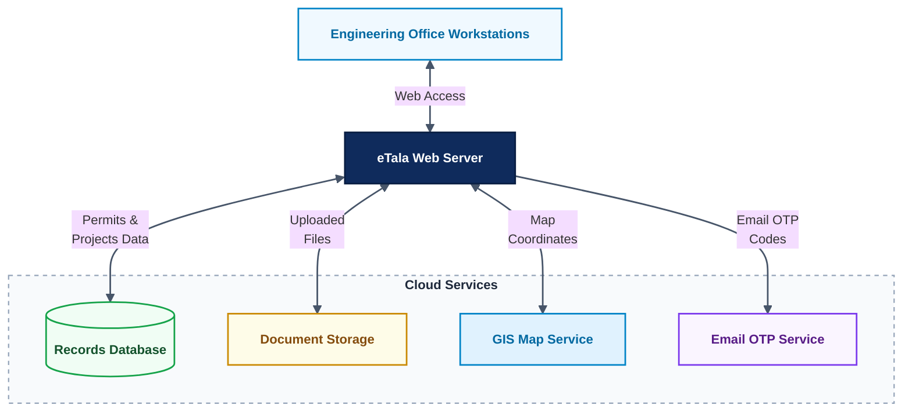
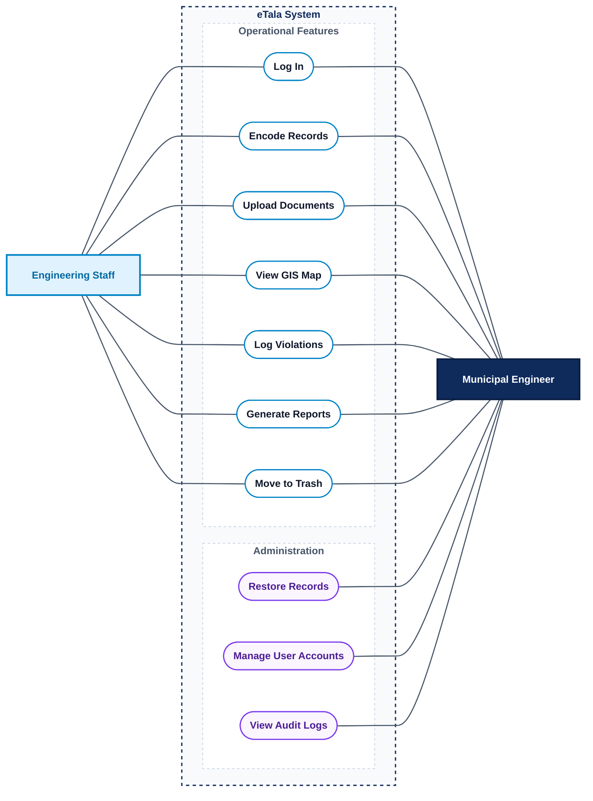
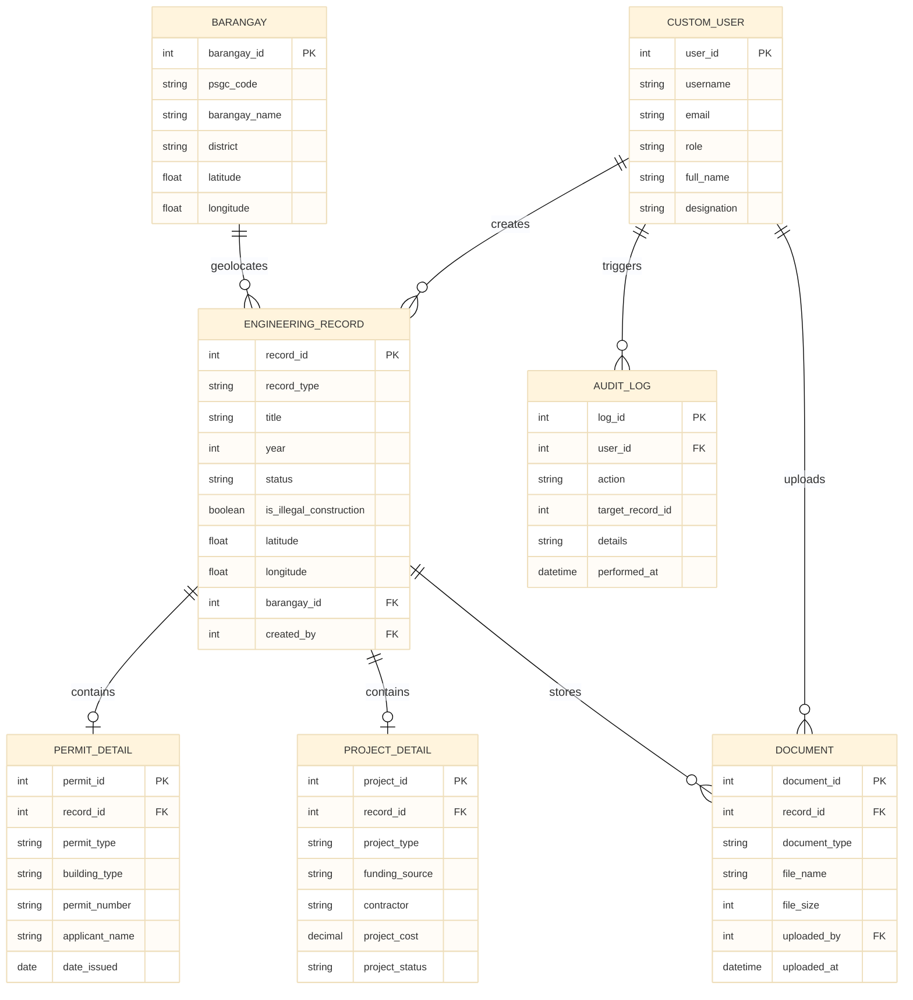
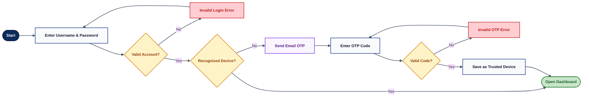
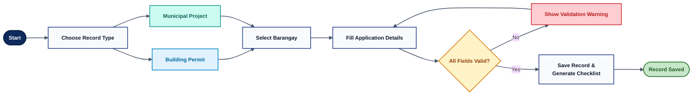
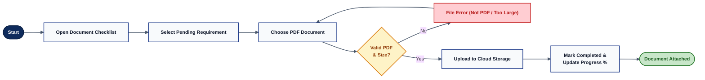
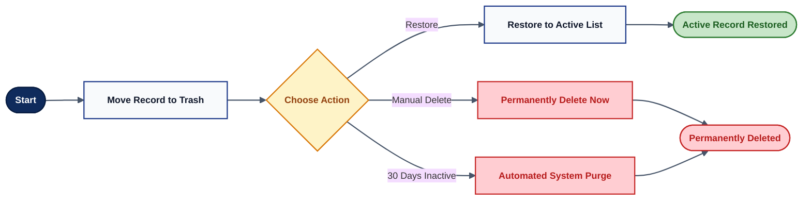
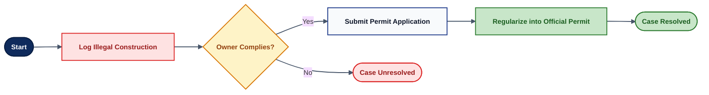

# Chapter 3: System Architecture and System Design
### eTala: Engineering Office Management and GIS Information System
**Municipal Engineering Office — Local Government Unit of Carigara, Leyte**

---

## Figure 3.1: Hardware and Cloud Architecture

Figure 3.1 illustrates the hardware and cloud architecture connecting office workstations to the eTala web server. The server connects to cloud services for database records, document storage, GIS map displays, and email login verification codes.

**Figure 3.1. Hardware and Cloud Architecture**

---

## Figure 3.2: Use Case Diagram

Figure 3.2 outlines the operational functions assigned to Engineering Staff and the Municipal Engineer in the eTala system. Engineering Staff handle record encoding, document uploads, map viewing, violation logging, and report generation, while the Municipal Engineer has full access to all operational tasks plus exclusive controls for user accounts, audit logs, and record restorations.

**Figure 3.2. Use Case Diagram**

---

## Figure 3.3: Project Development Timeline (Gantt Chart)

Figure 3.3 presents the five-month development timeline of the eTala system from June to October. It details the sequential execution of planning, database design, software development, system testing, cloud deployment, and final user evaluation.

| Tasks / SDLC Phases | June | July | August | September | October |
| :--- | :---: | :---: | :---: | :---: | :---: |
| **Planning** | June 1 – 30 | | | | |
| **Design** | June 15 – 30 | July 1 – 31 | | | |
| **Development** | | July 1 – 31 | Aug 1 – 31 | Sept 1 – 15 | |
| **Testing** | | | Aug 15 – 31 | Sept 1 – 30 | |
| **Deployment** | | | | Sept 15 – 30 | Oct 1 – 15 |
| **Evaluation** | | | | | Oct 1 – 31 |
| **Documentation** | Continuous | Continuous | Continuous | Continuous | Continuous |

**Figure 3.3. Project Development Timeline (Gantt Chart)**

---

## Figure 3.4: Database Entity-Relationship Diagram (ERD)

Figure 3.4 shows the database tables and relationships supporting the eTala system. The central engineering records table links to barangay locations, user accounts, permit and project details, uploaded documents, and system audit logs.

**Figure 3.4. Database Entity-Relationship Diagram (ERD)**

---

## Figure 3.5A: Login and Two-Factor Authentication Flow

Figure 3.5A illustrates the two-factor authentication security workflow for accessing the eTala system. Recognized office devices open the dashboard directly, while unrecognized devices require a one-time verification code sent via email before access is granted.

**Figure 3.5A. Login and Two-Factor Authentication Flow**

---

## Figure 3.5B: Record Encoding Flow

Figure 3.5B illustrates the step-by-step process of encoding permit and infrastructure records in eTala. The user selects the record type, designates the barangay, and fills in required details to save the entry and automatically generate the document checklist.

**Figure 3.5B. Record Encoding Flow**

---

## Figure 3.5C: Document Upload Flow

Figure 3.5C illustrates the document attachment and cloud synchronization process in the eTala system. An authorized user selects a pending checklist item and uploads a validated PDF file to update the record's progress and cloud storage.

**Figure 3.5C. Document Upload Flow**

---

## Figure 3.5D: Trash and Recovery Flow

Figure 3.5D illustrates the soft-deletion, restoration, and automated archiving lifecycle in eTala. Deleted records are moved to a temporary trash repository where the Municipal Engineer can restore them to active status, delete them permanently, or let the system purge them after thirty days.

**Figure 3.5D. Trash and Recovery Flow**

---

## Figure 3.5E: Violation Tracking and Regularization Flow

Figure 3.5E illustrates the regulatory workflow for logging and resolving illegal construction incidents in the municipality. Personnel log violation reports with photos, which are converted into official building permits once the owner complies with documentary requirements.

**Figure 3.5E. Violation Tracking and Regularization Flow**

---

## Figure 3.6A: Data Flow Diagram Level 0 (Context Diagram)

Figure 3.6A illustrates the Level 0 Data Flow Diagram showing the high-level data exchanges between office users and the eTala system. Engineering Staff submit application details and files to receive document checklists and map displays, while the Municipal Engineer interacts with all operational functions in addition to managing user accounts, summary reports, and audit logs.

**Figure 3.6A. Data Flow Diagram Level 0 (Context Diagram)**

---

## Figure 3.6B: Data Flow Diagram Level 1

Figure 3.6B illustrates the Level 1 Data Flow Diagram showing how information moves across the core processes of the eTala system. Engineering Staff encode application details into Record Management to store and retrieve records in the database, while GIS Mapping displays interactive map locations and Report Generation compiles accomplishment reports for the Municipal Engineer.

```mermaid
%%{init: {'theme': 'base', 'themeVariables': {'fontFamily': 'Arial, sans-serif', 'fontSize': '12px'}}}%%
flowchart LR
    Staff["Engineering Staff"]
    
    P1["Record Management"]
    P2["GIS Mapping"]
    P3["Report Generation"]
    
    DB[("Records Database")]
    Admin["Municipal Engineer"]

    Staff -->|Application Details| P1
    P1 <-->|Permit & Project Records| DB

    DB -->|Map Coordinates| P2
    P2 -->|Interactive Map View| Staff

    DB -->|Compiled Record Summaries| P3
    P3 -->|Accomplishment Reports| Admin

    classDef default fill:#f8fafc,stroke:#1e3a8a,stroke-width:1.5px,color:#0f172a,font-weight:600;
    classDef staff fill:#e0f2fe,stroke:#0284c7,stroke-width:2px,color:#0369a1,font-weight:bold;
    classDef admin fill:#0f2b5c,stroke:#091e42,stroke-width:2px,color:#ffffff,font-weight:bold;
    classDef proc fill:#0f2b5c,stroke:#091e42,stroke-width:1.5px,color:#ffffff,font-weight:bold;
    classDef db fill:#f0fdf4,stroke:#16a34a,stroke-width:1.8px,color:#14532d,font-weight:bold;

    class Staff staff;
    class Admin admin;
    class P1,P2,P3 proc;
    class DB db;
    linkStyle default stroke:#475569,stroke-width:1.5px;
```

**Figure 3.6B. Data Flow Diagram Level 1**
